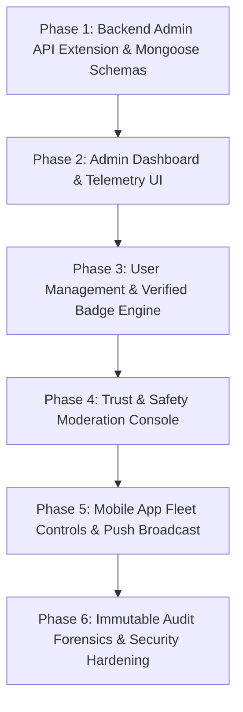

# 🛡️ DevHub Unified Operations & Admin Control Center (LinkedIn-Grade)
## Enterprise Cross-Platform Operations, Trust & Safety, Fleet Governance & Compliance Architecture

> **Document Classification:** Master Operations Blueprint & Technical Implementation Standard  
> **Industry Reference:** LinkedIn Operations Hub, Meta Trust & Safety Sentinel, Stripe Dashboard  
> **Platform Scope:** Web Application (`localhost:5173`), Mobile Application (iOS & Android Flutter App), Operations Console (`localhost:5174`)  
> **Backend Stack:** Node.js, Express.js 5.x, MongoDB Atlas, Redis (Mutex/Queues), Socket.IO, Firebase Cloud Messaging (FCM), Apple Push Notification service (APNs)

---

## 📑 Table of Contents
1. [Executive Ecosystem & High-Concurrency Architecture](#1-executive-ecosystem--high-concurrency-architecture)
2. [Multi-Tier Role-Based Access Control (RBAC) & Zero-Trust Security](#2-multi-tier-role-based-access-control-rbac--zero-trust-security)
3. [LinkedIn-Grade Trust & Safety Engine (T&S Sentinel)](#3-linkedin-grade-trust--safety-engine-ts-sentinel)
   - [3.1 Distributed Ticket Queue with Mutex Locking (Redis)](#31-distributed-ticket-queue-with-mutex-locking-redis)
   - [3.2 4-Eyes Principle (Dual-Authorization / Maker-Checker)](#32-4-eyes-principle-dual-authorization--maker-checker)
   - [3.3 Stealth Shadowbanning & Bot Isolation Engine](#33-stealth-shadowbanning--bot-isolation-engine)
   - [3.4 Automated Heuristic Spam & Toxicity Filters](#34-automated-heuristic-spam--toxicity-filters)
4. [Mobile App Fleet Governance (iOS & Android Flutter)](#4-mobile-app-fleet-governance-ios--android-flutter)
   - [4.1 Dynamic Version Gatekeeper & Force-Update Controller](#41-dynamic-version-gatekeeper--force-update-controller)
   - [4.2 Over-The-Air (OTA) Feature Flags & Dynamic Killswitches](#42-over-the-air-ota-feature-flags--dynamic-killswitches)
   - [4.3 Remote Session Invalidation & Device Killswitch](#43-remote-session-invalidation--device-killswitch)
   - [4.4 Enterprise Push Notification Broadcast Engine (FCM / APNs)](#44-enterprise-push-notification-broadcast-engine-fcm--apns)
5. [User Identity & Forensic Security Hub](#5-user-identity--forensic-security-hub)
   - [5.1 Multi-Category Verification Authority (Badges & Tiers)](#51-multi-category-verification-authority-badges--tiers)
   - [5.2 Multi-Account Correlation & Ban Evasion Graph](#52-multi-account-correlation--ban-evasion-graph)
6. [Real-Time Telemetry, Network Graph & Business Analytics](#6-real-time-telemetry-network-graph--business-analytics)
7. [Immutable Security Audit Stream & GDPR Compliance](#7-immutable-security-audit-stream--gdpr-compliance)
8. [Database Schema Specifications (MongoDB Mongoose)](#8-database-schema-specifications-mongodb-mongoose)
9. [Complete Backend Admin API Reference Dictionary](#9-complete-backend-admin-api-reference-dictionary)
10. [Admin Portal Frontend UI Component Architecture](#10-admin-portal-frontend-ui-component-architecture)
11. [Step-by-Step Implementation Roadmap](#11-step-by-step-implementation-roadmap)

---

## 1. Executive Ecosystem & High-Concurrency Architecture

DevHub operations are built as a **distributed, event-driven operations control plane** capable of governing millions of users across Web, iOS, and Android while supporting hundreds of concurrent internal operators without race conditions or data corruption.

```
┌─────────────────────────────────────────────────────────────────────────────┐
│                 DEVHUB OPERATIONS & CONTROL CENTER (PORT 5174)              │
├──────────────────────┬───────────────────────────────┬──────────────────────┤
│  Super Admin Console │  Trust & Safety Queue (Hotkeys│  Mobile Fleet Center │
│  RBAC & Access Matrix│  Live Stream Telemetry        │  Audit Trail Explorer│
└──────────────────────┴───────────────┬───────────────┴──────────────────────┘
                                       │ (HTTPS REST + Admin JWT Scope Guard)
                                       ▼
┌─────────────────────────────────────────────────────────────────────────────┐
│                 ENTERPRISE ADMIN GATEWAY LAYER (PORT 5000)                  │
├─────────────────────────────────────────────────────────────────────────────┤
│  • RBAC & Scope Interceptor (Zero-Trust L0 to L5 Verification)              │
│  • Redis Mutex Lock Manager (Distributed Concurrency Protection)            │
│  • Push Notification Worker (Firebase Cloud Messaging + APNs)               │
│  • Write-Once-Read-Many (WORM) Immutable Audit Logger                       │
└───────────────────────┬─────────────────────────────┬───────────────────────┘
                        │                             │
                        ▼                             ▼
┌───────────────────────────────┐             ┌───────────────────────────────┐
│     WEB APPLICATION (5173)    │             │   FLUTTER MOBILE APP (iOS/AND)│
├───────────────────────────────┤             ├───────────────────────────────┤
│ • React SPA                   │             │ • Flutter 3.x Native Client   │
│ • Cookie & WebSocket Sync     │             │ • Bearer Header Authentication│
│ • Browser Push Notifications  │             │ • Native FCM / APNs Push      │
│ • Live Socket Stream          │             │ • Version Gate & Remote Kill  │
└───────────────────────────────┘             └───────────────────────────────┘
```

---

## 2. Multi-Tier Role-Based Access Control (RBAC) & Zero-Trust Security

In an enterprise organization, internal personnel operate strictly under the **Principle of Least Privilege (PoLP)**. Moderation staff must not have direct access to database records, user passwords, or billing data.

### 2.1 Role Hierarchy Matrix

| Tier | Role Key | Target Personnel | Core Scope & Responsibilities |
| :--- | :--- | :--- | :--- |
| **L5: Super Admin** | `super_admin` | CTO, Founders, Execs | Full platform control, RBAC role granting, database disaster recovery, global app killswitch, raw API keys, brand settings. |
| **L4: Operations Manager** | `ops_manager` | T&S Leads, Operations Heads | 4-Eyes approval review, moderator shift management, spam filter threshold tuning, broadcast announcements. |
| **L3: Safety & Compliance Officer**| `safety_officer` | Senior Compliance Staff | Account suspension, legal/DMCA takedowns, child safety/harassment triage, GDPR data erasures. |
| **L2: Content Moderator** | `moderator` | Content Moderation Team | Review reported posts/comments, dismiss false flags, delete spam, apply user warnings. *(User PII masked)*. |
| **L1: Support Specialist** | `support_agent` | Customer Service Staff | OTP assistance, profile recovery, ticket handling. Read-only profile view with masked emails. |
| **L0: Growth & BI Analyst** | `analyst` | Data & Marketing Teams | Read-only access to anonymized analytics, retention cohorts, DAU/MAU metrics, conversion funnels. |

### 2.2 Cryptographic Scope Array in JWT
Every administrative action verifies granular scopes embedded in the session:
```json
{
  "adminId": "6a4b768c2b2666032d989e81",
  "role": "super_admin",
  "scopes": [
    "users:read", "users:write", "users:suspend", "users:badge", "users:role",
    "content:read", "content:delete", "content:triage",
    "mobile:config", "mobile:push", "mobile:kill",
    "audit:read", "analytics:read"
  ],
  "ipSubnet": "192.168.1.0/24"
}
```

---

## 3. LinkedIn-Grade Trust & Safety Engine (T&S Sentinel)

### 3.1 Distributed Ticket Queue with Mutex Locking (Redis)
When 200 moderators simultaneously review 5,000 reported posts, naive database queries result in duplicate actions. DevHub Sentinel implements **Distributed Mutex Locking**:

```
[ User Reports Ingestion ]
           │
           ▼
[ Redis Priority Queue: HIGH / MED / LOW ]
           │
           ├───► Mod A clicks "Next Case" ───► [ Acquired Mutex: Post #402 (TTL: 5 min) ]
           │                                          │
           │                                     Post #402 locked & hidden from other 199 mods
           │                                          │
           └───► Mod B clicks "Next Case" ───► [ Acquired Mutex: Post #403 (TTL: 5 min) ]
```

1. **PULL-Mode Auto-Assignment:** Moderators do not pick cases manually from a list. Clicking **"Start Triage Session"** automatically pops the highest priority report.
2. **5-Minute Soft Lock:** If a moderator closes their tab or remains idle, the Redis lock automatically expires and returns the case to the global queue.
3. **Speed Console Hotkeys:**
   - `J` / `K` ➔ Next / Previous Case
   - `D` ➔ Delete Post & Send Warning
   - `S` ➔ Stealth Shadowban
   - `A` ➔ Approve & Dismiss Report

### 3.2 4-Eyes Principle (Dual-Authorization / Maker-Checker)
High-impact destructive actions (e.g. banning an account with >5,000 connections, or deleting a verified company profile) require dual authorization:
1. **Maker (L2 Moderator):** Flags account: *"Propose Suspension for @bad_actor (Reason: Copyright Infringement)"*.
2. **Checker (L4 Lead Admin):** Receives notification in the **Approval Inbox**.
3. **Execution:** Database mutation only occurs once the Lead Admin verifies and cryptographically approves the ticket.

### 3.3 Stealth Shadowbanning & Bot Isolation Engine
- When an abusive user or automated spam bot is shadowbanned (`isShadowBanned: true`):
  - **Offender's Experience:** They can still post, like, and comment normally on their screen without error.
  - **Platform Experience:** The feed and search algorithms silently filter their posts for all other users.
  - **Benefit:** Spammers and botnet controllers do not realize they have been neutralized, preventing them from instantly generating new accounts.

### 3.4 Automated Heuristic Spam & Toxicity Filters
- Real-time pre-filter inspects all incoming posts and comments for:
  - Known phishing / scam domains.
  - Rapid message velocity (>10 posts per minute ➔ auto-flagged).
  - Malicious / obfuscated script payloads in code blocks.

---

## 4. Mobile App Fleet Governance (iOS & Android Flutter)

### 4.1 Dynamic Version Gatekeeper & Force-Update Controller
Controls minimum supported mobile versions dynamically from the admin panel without backend code modifications:

```json
{
  "android": {
    "minVersion": "1.0.2",
    "latestVersion": "1.1.0",
    "forceUpdate": true,
    "storeUrl": "https://play.google.com/store/apps/details?id=com.devhub.app",
    "releaseNotes": "Critical security patches & 60 FPS feed optimization."
  },
  "ios": {
    "minVersion": "1.0.2",
    "latestVersion": "1.1.0",
    "forceUpdate": true,
    "storeUrl": "https://apps.apple.com/app/devhub/id123456789",
    "releaseNotes": "Support for iOS 18 dynamic widgets and biometric login."
  }
}
```

- **Flutter Client Handshake (`/api/app/config`):**
  - If `installed_version < minVersion` AND `forceUpdate == true` ➔ App displays a non-dismissible modal directing user to App Store / Play Store.

### 4.2 Over-The-Air (OTA) Feature Flags & Dynamic Killswitches
Admins can toggle mobile features instantly across all active apps:
- `feature_code_sharing`: `true` / `false`
- `feature_video_upload`: `true` / `false`
- `feature_job_board`: `true` / `false`
- `feature_dmca_scanner`: `true` / `false`

### 4.3 Remote Session Invalidation & Device Killswitch
- **1-Click Remote Invalidation:** When an account is suspended or reported for fraud, the admin triggers `POST /api/admin/users/:id/revoke-sessions`.
- Backend increments `user.tokenVersion`. On the next API request from the Flutter app, the `DioClient` interceptor receives `401 Unauthorized` and clears local `FlutterSecureStorage`, returning the app to the login screen.

### 4.4 Enterprise Push Notification Broadcast Engine (FCM / APNs)
- Multi-Channel Broadcast Manager:
  - **Channel 1 (In-App Banner):** Web & Mobile top sticky alert bar.
  - **Channel 2 (System Notification Inbox):** Injected into user's `/api/notifications` feed.
  - **Channel 3 (Native Push Notification):** Dispatched via Firebase Cloud Messaging & APNs to iOS/Android device lock screens.
- **Targeting Segments:**
  - `ALL_USERS`: Entire registered platform base.
  - `MOBILE_ONLY`: Users with registered mobile FCM tokens.
  - `VERIFIED_ONLY`: Developers with verified blue checkmarks.
  - `INACTIVE_USERS`: Users inactive for >14 days (re-engagement campaign).

---

## 5. User Identity & Forensic Security Hub

### 5.1 Multi-Category Verification Authority (Badges & Tiers)
1-Click verification badge assignment across developer and creator categories:
- 🔵 **Verified Developer / Architect:** Industry professional badge.
- 🌟 **Top Open-Source Creator:** Star contributor badge.
- 🏢 **Official Organization / Enterprise:** Corporate recruitment badge.

### 5.2 Multi-Account Correlation & Ban Evasion Graph
- Correlates user accounts based on:
  - Shared IP Subnets & Login Timestamps.
  - Shared GitHub / Google OAuth email domains.
  - Device Fingerprint IDs (Mobile device UUID & Browser Canvas hash).

---

## 6. Real-Time Telemetry, Network Graph & Business Analytics

```
┌─────────────────────────────────────────────────────────────────────────────┐
│                     LIVE PLATFORM HEALTH TELEMETRY                          │
├─────────────────────┬─────────────────────┬───────────────────┬─────────────┤
│ Total Users         │ Active Web Sockets  │ Active Mobile App │ Posts / Min │
│ 142,850 (+12% MoM)  │ 3,420 Live Users    │ 8,910 Live Users  │ 42.8 / min  │
└─────────────────────┴─────────────────────┴───────────────────┴─────────────┘
```

- **Key Metrics Tracked in Real-Time:**
  - **Active Fleet:** Live Web sockets vs Mobile Flutter app sockets.
  - **Engagement Velocity:** Likes, Reposts, and Messages exchanged per second.
  - **Spam Anomaly Spike Detector:** Alert triggers if post velocity exceeds 500% of baseline.
  - **Network Graph Density:** Mutual connection clusters across technologies (React, Rust, Flutter, Python).

---

## 7. Immutable Security Audit Stream & GDPR Compliance

Every mutation made by any admin is recorded in an **immutable, append-only database collection** (`AuditLog`):

```json
{
  "_id": "6a4b768c...",
  "timestamp": "2026-08-19T14:45:00.000Z",
  "actor": {
    "adminId": "6a4b768c2b2666032d989e81",
    "name": "Subhan Shahid",
    "email": "subhanshahid839@gmail.com",
    "role": "super_admin"
  },
  "action": "USER_SUSPENDED",
  "target": {
    "entityType": "User",
    "entityId": "67bc910a2f...",
    "targetEmail": "spammer@botnet.com"
  },
  "details": {
    "reason": "Automated crypto spam detected",
    "previousState": { "isSuspended": false },
    "newState": { "isSuspended": true }
  },
  "metadata": {
    "ipAddress": "192.168.1.15",
    "userAgent": "Mozilla/5.0 (Windows NT 10.0; Win64; x64) Chrome/128.0"
  }
}
```

- **GDPR 1-Click Compliance:**
  - Export User Data Package (JSON archive of posts, comments, messages, profile).
  - Cryptographic Hard Erasure ("Right to be Forgotten").

---

## 8. Database Schema Specifications (MongoDB Mongoose)

### 8.1 Moderation Ticket Schema (`backend/src/models/ModerationTicket.js`)
```javascript
const mongoose = require('mongoose');

const moderationTicketSchema = new mongoose.Schema({
  targetType: { 
    type: String, 
    enum: ['post', 'comment', 'user', 'message'], 
    required: true 
  },
  targetId: { type: mongoose.Schema.Types.ObjectId, required: true },
  reportedBy: { type: mongoose.Schema.Types.ObjectId, ref: 'User', required: true },
  reason: { 
    type: String, 
    enum: ['spam', 'harassment', 'malicious_code', 'copyright', 'impersonation', 'other'], 
    required: true 
  },
  details: { type: String },
  priority: { type: String, enum: ['high', 'medium', 'low'], default: 'medium' },
  status: { 
    type: String, 
    enum: ['pending', 'locked', 'resolved', 'dismissed', 'escalated'], 
    default: 'pending' 
  },
  lockedBy: { type: mongoose.Schema.Types.ObjectId, ref: 'User' },
  lockedUntil: { type: Date },
  resolvedBy: { type: mongoose.Schema.Types.ObjectId, ref: 'User' },
  resolutionAction: { type: String, enum: ['deleted', 'warned', 'shadowbanned', 'dismissed'] },
  resolutionNotes: { type: String },
}, { timestamps: true });

module.exports = mongoose.model('ModerationTicket', moderationTicketSchema);
```

### 8.2 App Configuration Schema (`backend/src/models/AppConfig.js`)
```javascript
const mongoose = require('mongoose');

const appConfigSchema = new mongoose.Schema({
  key: { type: String, default: 'global_config', unique: true },
  android: {
    minVersion: { type: String, default: '1.0.0' },
    latestVersion: { type: String, default: '1.0.0' },
    forceUpdate: { type: Boolean, default: false },
    storeUrl: { type: String, default: '' },
    releaseNotes: { type: String, default: '' },
  },
  ios: {
    minVersion: { type: String, default: '1.0.0' },
    latestVersion: { type: String, default: '1.0.0' },
    forceUpdate: { type: Boolean, default: false },
    storeUrl: { type: String, default: '' },
    releaseNotes: { type: String, default: '' },
  },
  maintenanceMode: {
    enabled: { type: Boolean, default: false },
    message: { type: String, default: 'DevHub is undergoing scheduled infrastructure upgrades.' },
  },
  featureFlags: {
    codeSharing: { type: Boolean, default: true },
    videoUploads: { type: Boolean, default: true },
    aiAssistant: { type: Boolean, default: true },
  }
}, { timestamps: true });

module.exports = mongoose.model('AppConfig', appConfigSchema);
```

### 8.3 Audit Log Schema (`backend/src/models/AuditLog.js`)
```javascript
const mongoose = require('mongoose');

const auditLogSchema = new mongoose.Schema({
  actor: {
    adminId: { type: mongoose.Schema.Types.ObjectId, ref: 'User', required: true },
    name: { type: String, required: true },
    email: { type: String, required: true },
    role: { type: String, required: true },
  },
  action: { type: String, required: true },
  target: {
    entityType: { type: String, required: true },
    entityId: { type: mongoose.Schema.Types.ObjectId },
    targetEmail: { type: String },
  },
  details: { type: mongoose.Schema.Types.Mixed },
  ipAddress: { type: String },
  userAgent: { type: String },
}, { timestamps: true });

module.exports = mongoose.model('AuditLog', auditLogSchema);
```

---

## 9. Complete Backend Admin API Reference Dictionary

All routes are mounted under `/api/admin` and protected by `protect` and `protectAdmin`.

| Method | Endpoint | Allowed Roles | Request Body Schema | Description |
| :--- | :--- | :--- | :--- | :--- |
| `GET` | `/api/admin/stats` | All Roles | — | Platform telemetry: users, active sockets, posts, pending tickets. |
| `GET` | `/api/admin/users` | All Roles | `?page=1&limit=20&search=...&role=...&status=...` | Paginated user management table. |
| `PUT` | `/api/admin/users/:id/status` | `admin`, `super_admin` | `{ "isSuspended": boolean, "reason": string }` | Suspend or reactivate user account. |
| `PUT` | `/api/admin/users/:id/badge` | `admin`, `super_admin` | `{ "isVerifiedBadge": boolean }` | Toggle official verified checkmark. |
| `PUT` | `/api/admin/users/:id/role` | `super_admin` | `{ "role": "user" \| "moderator" \| "admin" }` | Change user RBAC permission role. |
| `POST`| `/api/admin/users/:id/revoke-sessions` | `super_admin` | — | Invalidates all active mobile & web sessions. |
| `GET` | `/api/admin/reports` | All Roles | `?status=pending&priority=high&page=1` | Content moderation triage queue. |
| `POST`| `/api/admin/reports/:id/lock` | `moderator`, `admin` | — | Locks report ticket for 5 minutes (Mutex). |
| `POST`| `/api/admin/reports/:id/action` | All Roles | `{ "action": "delete" \| "dismiss" \| "shadowban", "reason": string }` | Resolve reported content. |
| `POST`| `/api/admin/broadcast` | `admin`, `super_admin` | `{ "title": string, "message": string, "sendPush": boolean, "target": string }` | Dispatch multi-channel broadcast alert. |
| `GET` | `/api/admin/app-config` | All Roles | — | Fetch mobile app versioning and feature flags. |
| `PUT` | `/api/admin/app-config` | `super_admin` | `{ "android": { ... }, "ios": { ... }, "maintenanceMode": { ... } }` | Update mobile app version rules. |
| `GET` | `/api/admin/audit-logs` | `super_admin` | `?page=1&limit=50&adminId=...&action=...` | Query immutable audit forensics trail. |

---

## 10. Admin Portal Frontend UI Component Architecture

Located in `admin/src/`:

```
admin/src/
├── api/
│   └── adminApi.js             # Axios client with credentials & error toast
├── components/
│   ├── layout/
│   │   ├── AdminSidebar.jsx    # Sleek navigation drawer with RBAC tab filtering
│   │   ├── AdminHeader.jsx     # Current admin profile, socket live indicator, logout
│   │   └── MetricCard.jsx      # Glowing neon stat cards with trend indicators
│   ├── users/
│   │   ├── UserTable.jsx       # User list with 1-click badge toggle & role dropdown
│   │   └── UserDetailsModal.jsx# Full user forensics (IP history, devices, reports)
│   ├── moderation/
│   │   ├── ReportQueueCard.jsx # Hotkey-enabled moderation review card
│   │   └── CodeReviewViewer.jsx# Syntax-highlighted suspicious code viewer
│   ├── broadcast/
│   │   └── PushComposerModal.jsx# Multi-channel push notification composer
│   └── common/
│       ├── ConfirmModal.jsx    # Destructive action double-confirmation dialog
│       ├── StatusPill.jsx      # Color-coded badge chips for roles and statuses
│       └── Pagination.jsx      # Reusable pagination component
├── pages/
│   ├── AdminLoginPage.jsx      # Zero-trust login console (`http://localhost:5174/login`)
│   ├── AdminDashboardPage.jsx  # Overview metrics, charts, quick operational actions
│   ├── UsersManagementPage.jsx # Full user database search, verification, and bans
│   ├── ContentModerationPage.jsx# Reported posts/comments triage queue
│   ├── BroadcastPage.jsx       # Global banner & mobile push notification manager
│   ├── MobileAppConfigPage.jsx # Mobile version gatekeeper & maintenance controls
│   └── AuditLogsPage.jsx       # Immutable security audit trail explorer
└── store/
    └── useAdminStore.js        # Global admin session & real-time socket state
```

---

## 11. Step-by-Step Implementation Roadmap



- [x] **Milestone 0:** Super Admin account created (`subhanshahid839@gmail.com` / `drox12345`) and verified.
- [ ] **Phase 1 (Backend APIs):** Create `AuditLog`, `AppConfig`, and `ModerationTicket` schemas; implement controllers for `/api/admin/*`.
- [ ] **Phase 2 (Dashboard UI):** Build live metrics cards on `AdminDashboardPage.jsx` connected to live backend data.
- [ ] **Phase 3 (User Management):** Build `UsersManagementPage.jsx` with live search, role dropdown, suspension modal, and 1-click verified badge toggle.
- [ ] **Phase 4 (Content Moderation):** Build `ContentModerationPage.jsx` with 1-click Delete, Dismiss, and Shadowban actions.
- [ ] **Phase 5 (Mobile Fleet & Broadcast):** Build `MobileAppConfigPage.jsx` and `BroadcastPage.jsx` for push notification dispatch.
- [ ] **Phase 6 (Audit Logs):** Build `AuditLogsPage.jsx` for full security forensics.
