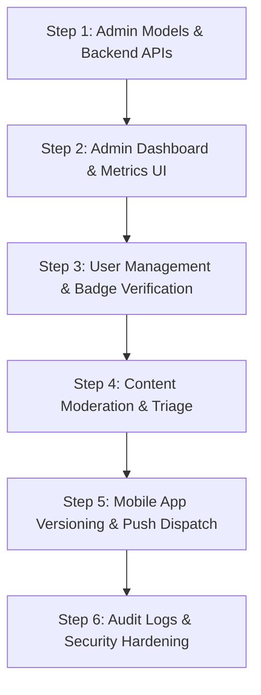

# 🛡️ DevHub Unified Operations & Admin Control Center
## Enterprise Cross-Platform Governance Architecture (Web & Mobile App Ecosystem)

> **Document Type:** Master Implementation Blueprint & Full-Stack Operations Specification  
> **Ecosystem Scope:** Web Application (`localhost:5173` / Web Client), Mobile Application (iOS & Android Flutter App), and Operations Console (`localhost:5174` / Admin Portal)  
> **Backend Service:** Node.js, Express.js 5.x, MongoDB Atlas, Socket.IO, Firebase Cloud Messaging (FCM)

---

## 📑 Table of Contents
1. [Executive Ecosystem Architecture](#1-executive-ecosystem-architecture)
2. [Mobile-First Admin Governance & Controls](#2-mobile-first-admin-governance--controls)
3. [Multi-Tier Role-Based Access Control (RBAC)](#3-multi-tier-role-based-access-control-rbac)
4. [Core Operations Modules Breakdown](#4-core-operations-modules-breakdown)
   - [Module 1: User Identity & Account Governance](#module-1-user-identity--account-governance)
   - [Module 2: Content Moderation & Triage Queue](#module-2-content-moderation--triage-queue)
   - [Module 3: Global Broadcast & Mobile Push Notifications](#module-3-global-broadcast--mobile-push-notifications)
   - [Module 4: Real-Time Analytics & Device Telemetry](#module-4-real-time-analytics--device-telemetry)
   - [Module 5: App Versioning & Maintenance Control](#module-5-app-versioning--maintenance-control)
   - [Module 6: Immutable Security Audit Forensics](#module-6-immutable-security-audit-forensics)
5. [Complete Backend Admin API Reference Dictionary](#5-complete-backend-admin-api-reference-dictionary)
6. [Admin Portal Frontend UI Architecture](#6-admin-portal-frontend-ui-architecture)
7. [Step-by-Step Implementation Roadmap](#7-step-by-step-implementation-roadmap)

---

## 1. Executive Ecosystem Architecture

The DevHub platform manages millions of interactions originating from both **Web browsers** and **iOS & Android Flutter mobile applications**. The Operations Console is the central command center for user security, content moderation, push notifications, and platform health.

```
┌─────────────────────────────────────────────────────────────────────────────┐
│                 DEVHUB OPERATIONS & CONTROL CENTER (PORT 5174)              │
├─────────────────────────────────────────────────────────────────────────────┤
│  • Super Admin Console   • Trust & Safety Queue   • User Forensics          │
│  • Mobile Push Dispatch  • Force Update Config    • Real-Time Analytics     │
└──────────────────────────────────────┬──────────────────────────────────────┘
                                       │ (REST API + Admin JWT)
                                       ▼
┌─────────────────────────────────────────────────────────────────────────────┐
│                       DEVHUB CORE BACKEND (PORT 5000)                       │
├─────────────────────────────────────────────────────────────────────────────┤
│  • Admin Gateway & RBAC Guard (`protectAdmin`, `super_admin`, `moderator`) │
│  • Audit Interceptor (Immutable Action Logging)                             │
│  • Socket.IO Gateway (Live Telemetry & Instant Disconnects)                │
│  • Push Notification Engine (FCM / APNS)                                   │
└───────────────────────┬─────────────────────────────┬───────────────────────┘
                        │                             │
                        ▼                             ▼
┌───────────────────────────────┐             ┌───────────────────────────────┐
│     WEB APPLICATION (5173)    │             │   MOBILE FLUTTER APP (iOS/AND)│
├───────────────────────────────┤             ├───────────────────────────────┤
│ • React SPA                   │             │ • Flutter 3.x Native Client   │
│ • Cookie-Based Auth           │             │ • Bearer Token Auth           │
│ • Browser Push Notifications  │             │ • FCM Native Push Alerts      │
│ • Live Socket Stream          │             │ • Device State & Force Update │
└───────────────────────────────┘             └───────────────────────────────┘
```

---

## 2. Mobile-First Admin Governance & Controls

Because the platform includes a native **Flutter mobile app**, the admin panel must feature mobile-specific governance mechanisms:

### 2.1 Remote Session Termination & Token Invalidation
- **Scenario:** A user account is compromised on a lost phone, or a banned spammer is using an active mobile session.
- **Admin Action:** 1-Click **"Revoke Mobile Sessions"**.
- **Mechanism:** Backend increments `user.tokenVersion` or purges the user's active refresh tokens. The mobile app's Dio interceptor receives a `401 Unauthorized` on its next request and instantly redirects to the Login screen.

### 2.2 Mobile Push Notification Dispatcher (FCM / APNS)
- Send instant push alerts directly to iOS & Android lock screens.
- **Targeting Modes:**
  - *Global Broadcast:* All registered mobile app installs.
  - *Segmented:* Filter by role, country, inactive days (>7 days), or verified developers.
  - *Individual:* Targeted direct alert (e.g. security notice, account warning).

### 2.3 Mobile App Version Control & Force Update Engine
- Configure minimum supported app version dynamically without rebuilding the backend.
- **Admin Settings Schema:**
  ```json
  {
    "android": {
      "minVersion": "1.0.2",
      "latestVersion": "1.1.0",
      "forceUpdate": true,
      "storeUrl": "https://play.google.com/store/apps/details?id=com.devhub.app"
    },
    "ios": {
      "minVersion": "1.0.2",
      "latestVersion": "1.1.0",
      "forceUpdate": true,
      "storeUrl": "https://apps.apple.com/app/devhub/id123456789"
    }
  }
  ```
- **Mobile Handshake:** During app startup, the Flutter app queries `/api/app/config`. If `installed_version < minVersion` and `forceUpdate == true`, the Flutter app displays a blocking "Update Required" dialog.

### 2.4 Mobile Emergency Killswitch / Maintenance Mode
- 1-Click toggle from the admin panel to place the mobile app in read-only or maintenance mode during server migrations or database upgrades.

---

## 3. Multi-Tier Role-Based Access Control (RBAC)

| Tier | Role Key | Permitted Operations | Restricted Areas |
| :--- | :--- | :--- | :--- |
| **L3: Super Admin** | `super_admin` | Full system control, role assignment, database actions, platform settings, broadcast push, delete users, unban accounts. | None |
| **L2: Administrator**| `admin` | User management, verification badge issuance, content deletion, report resolution, analytics viewing. | Cannot promote/demote Super Admins, cannot view raw API secret keys. |
| **L1: Moderator** | `moderator` | Content moderation queue (posts/comments), dismiss reports, flag users for review, apply temporary warnings. | Cannot ban users, cannot access system settings or broadcast tools. |

---

## 4. Core Operations Modules Breakdown

### Module 1: User Identity & Account Governance
- **Search & Filter:** Search by Name, Email, Username, Role, Status (`Active`, `Suspended`, `Unverified`).
- **User Action Panel:**
  - 🔵 **Toggle Verified Badge:** 1-Click grant or revoke blue verified checkmark (`isVerifiedBadge: true/false`).
  - ⛔ **Suspend / Unsuspend:** Set `isSuspended: true`, enter mandatory suspension reason, and immediately disconnect active sockets.
  - 👤 **Role Promotion/Demotion:** Promote user to `moderator` or `admin` (Super Admin only).
  - 🔑 **Force Password Reset:** Generates a temporary reset link or forces password change on next login.

### Module 2: Content Moderation & Triage Queue
- **Reported Queue:** Displays user-submitted flags on posts, comments, or profiles (e.g. Spam, Harassment, Inappropriate Code).
- **1-Click Triage Actions:**
  - `Approve / Dismiss`: Marks report as false flag, leaves content intact.
  - `Delete Content`: Permanently removes offending post/comment and sends an automated notification to the author.
  - `Warn User`: Leaves warning strike on user profile (`warningsCount + 1`).

### Module 3: Global Broadcast & Mobile Push Notifications
- **Rich Message Composer:** Title, message body, optional deep-link URL (e.g. `/post/123` or `/jobs`).
- **Channels:**
  - [x] In-App Notification Feed (Web & Mobile).
  - [x] Sticky Top Announcement Banner (Web & Mobile).
  - [x] Native Mobile Push Notification (FCM / APNS).

### Module 4: Real-Time Analytics & Device Telemetry
- **Live Platform Metrics:**
  - Total Registered Users & Active Sockets count.
  - Total Posts, Comments, and Network Connections count.
  - Platform Distribution: **Web vs iOS vs Android** usage breakdown.
  - Top 10 Trending Technologies (based on post tags and user skills).

### Module 5: App Versioning & Maintenance Control
- Dynamic configuration of Mobile App Minimum Version, Latest Version, Release Notes, and Store Redirect URLs.
- Global Maintenance Switch with custom downtime message.

### Module 6: Immutable Security Audit Forensics
- Append-only database collection recording every administrative action:
  ```json
  {
    "adminId": "6a4b768c2b2666032d989e81",
    "adminName": "Subhan Shahid",
    "adminEmail": "subhanshahid839@gmail.com",
    "action": "USER_VERIFIED_BADGE_GRANTED",
    "targetUserId": "67bc910a2f...",
    "details": "Granted verified badge upon GitHub portfolio validation",
    "ipAddress": "192.168.1.1",
    "timestamp": "2026-08-19T14:45:00Z"
  }
  ```

---

## 5. Complete Backend Admin API Reference Dictionary

All routes are mounted under `/api/admin` and guarded by `protect` + `protectAdmin` middleware.

| Method | Endpoint | Allowed Roles | Request Payload | Description |
| :--- | :--- | :--- | :--- | :--- |
| `GET` | `/api/admin/stats` | All Admin Roles | — | Returns platform summary metrics, user counts, and active sockets. |
| `GET` | `/api/admin/users` | All Admin Roles | `?page=1&limit=20&search=...&role=...&status=...` | Paginated user management table. |
| `PUT` | `/api/admin/users/:id/status` | `admin`, `super_admin` | `{ "isSuspended": true, "reason": "Spamming" }` | Suspend or reactivate user account. |
| `PUT` | `/api/admin/users/:id/badge` | `admin`, `super_admin` | `{ "isVerifiedBadge": true }` | Toggle official verified badge. |
| `PUT` | `/api/admin/users/:id/role` | `super_admin` | `{ "role": "moderator" \| "admin" \| "user" }` | Change user RBAC role. |
| `GET` | `/api/admin/reports` | All Admin Roles | `?status=pending&page=1` | Content moderation triage queue. |
| `POST` | `/api/admin/reports/:id/action` | All Admin Roles | `{ "action": "delete" \| "dismiss", "reason": "..." }` | Take action on reported content. |
| `POST` | `/api/admin/broadcast` | `admin`, `super_admin` | `{ "title": "...", "message": "...", "type": "info" \| "warning", "sendPush": true }` | Send platform-wide announcement. |
| `GET` | `/api/admin/app-config` | `super_admin` | — | Fetch mobile app version & maintenance settings. |
| `PUT` | `/api/admin/app-config` | `super_admin` | `{ "minVersion": "1.0.2", "forceUpdate": true, "maintenanceMode": false }` | Update mobile app version requirements. |
| `GET` | `/api/admin/audit-logs` | `super_admin` | `?page=1&limit=50` | Retrieve immutable admin action audit trail. |

---

## 6. Admin Portal Frontend UI Architecture

Located in `admin/src/`:

```
admin/src/
├── api/
│   └── adminApi.js             # Axios client with interceptors
├── components/
│   ├── layout/
│   │   ├── AdminSidebar.jsx    # Collapsible sidebar with navigation tabs
│   │   ├── AdminHeader.jsx     # Current admin profile, socket status, logout
│   │   └── MetricCard.jsx      # Glowing stat cards with micro-charts
│   ├── users/
│   │   ├── UserTable.jsx       # User table with badge toggle & suspend action
│   │   └── UserDetailsModal.jsx# Full user profile forensics & connection view
│   ├── moderation/
│   │   └── ReportQueueCard.jsx # Content triage card with 1-click actions
│   └── common/
│       ├── ConfirmModal.jsx    # Destructive action double-confirmation
│       └── StatusPill.jsx      # Color-coded badges for roles & statuses
├── pages/
│   ├── AdminLoginPage.jsx      # Sleek login page with zero-trust design
│   ├── AdminDashboardPage.jsx  # Overview metrics, charts, quick actions
│   ├── UsersManagementPage.jsx # Full user database, search, and permissions
│   ├── ContentModerationPage.jsx# Reported posts/comments triage console
│   ├── BroadcastPage.jsx       # Push notification & announcement manager
│   ├── MobileAppConfigPage.jsx # App versioning, force update & maintenance
│   └── AuditLogsPage.jsx       # Immutable audit forensics trail
└── store/
    └── useAdminStore.js        # Global admin session & real-time socket store
```

---

## 7. Step-by-Step Implementation Roadmap



### 🔹 Step 1: Backend Admin API Extensions
- Implement missing controller actions: `toggleBadge`, `changeUserRole`, `updateAppConfig`, `getAuditLogs`.
- Create `AuditLog` Mongoose schema and logging interceptor.

### 🔹 Step 2: Admin Dashboard Overview & Metrics
- Connect live backend stats (`/api/admin/stats`) to `AdminDashboardPage.jsx`.
- Render glowing metric cards: Total Users, Total Posts, Pending Reports, Active Sockets.

### 🔹 Step 3: User Management Table & Governance
- Build `UsersManagementPage.jsx` with real-time search, role filter, 1-click verified badge toggle, and account suspension modal.

### 🔹 Step 4: Content Moderation Console
- Build `ContentModerationPage.jsx` showing reported posts/comments with 1-click Delete, Dismiss, and Warn Author actions.

### 🔹 Step 5: Mobile App Governance & Broadcast Hub
- Build `MobileAppConfigPage.jsx` to configure Flutter app min version, force update toggle, and maintenance switch.
- Build `BroadcastPage.jsx` with push notification dispatcher.

### 🔹 Step 6: Immutable Audit Trail
- Build `AuditLogsPage.jsx` to give the Super Admin complete forensics over all administrative events.
