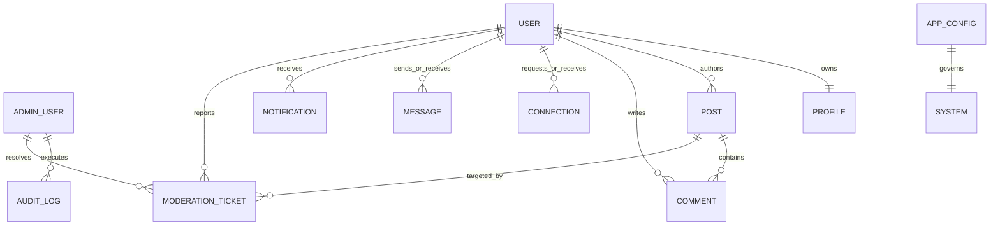

# 🗄️ DevHub Enterprise Database Architecture & Indexing Standard
## High-Performance, Distributed Multi-Collection Schema & Indexing Blueprint

> **System Grade:** LinkedIn & Stripe Level High-Concurrency Schema Standard  
> **Database Engine:** MongoDB Atlas 8.x Replica Set / Sharded Cluster  
> **ODM Framework:** Mongoose 8.x with TypeScript Schema Strictness  
> **Key Architecture Decision:** Complete **Decoupling of Internal Admin Operators (`admin_users`) from External Platform End-Users (`users`)** for zero-trust compliance, strict PII isolation, and clean micro-domain boundaries.

---

## 📑 Table of Contents
1. [Executive Entity Relationship Diagram (ERD)](#1-executive-entity-relationship-diagram-erd)
2. [Domain Decoupling & Collection Architecture](#2-domain-decoupling--collection-architecture)
   - [2.1 Internal Operations Domain (`admin_users`, `moderation_tickets`, `audit_logs`, `app_configs`)](#21-internal-operations-domain)
   - [2.2 User & Identity Domain (`users`, `profiles`, `pending_users`, `follows`)](#22-user--identity-domain)
   - [2.3 Social Content & Code Domain (`posts`, `comments`)](#23-social-content--code-domain)
   - [2.4 Communication & Real-Time Domain (`messages`, `connections`, `notifications`)](#24-communication--real-time-domain)
3. [Enterprise Indexing & Query Acceleration Strategy](#3-enterprise-indexing--query-acceleration-strategy)
4. [Complete Collection Schema & Index Specifications](#4-complete-collection-schema--index-specifications)
   - [Collection 1: `admin_users` (Dedicated Staff Operators)](#collection-1-admin_users-dedicated-staff-operators)
   - [Collection 2: `users` (Platform Developers & Creators)](#collection-2-users-platform-developers--creators)
   - [Collection 3: `profiles` (Developer Portfolio & Tech Stack)](#collection-3-profiles-developer-portfolio--tech-stack)
   - [Collection 4: `posts` (Social Feed & Code Snippets)](#collection-4-posts-social-feed--code-snippets)
   - [Collection 5: `comments` (Threaded Discussion Engine)](#collection-5-comments-threaded-discussion-engine)
   - [Collection 6: `connections` (Professional Network Graph)](#collection-6-connections-professional-network-graph)
   - [Collection 7: `messages` (Direct Messaging & Code Attachments)](#collection-7-messages-direct-messaging--code-attachments)
   - [Collection 8: `notifications` (Real-Time In-App Alerts)](#collection-8-notifications-real-time-in-app-alerts)
   - [Collection 9: `moderation_tickets` (Trust & Safety Queue)](#collection-9-moderation_tickets-trust--safety-queue)
   - [Collection 10: `app_configs` (Mobile Fleet & Version Gatekeeper)](#collection-10-app_configs-mobile-fleet--version-gatekeeper)
   - [Collection 11: `audit_logs` (Immutable Security Forensics)](#collection-11-audit_logs-immutable-security-forensics)
   - [Collection 12: `pending_users` (TTL OTP Registration Buffer)](#collection-12-pending_users-ttl-otp-registration-buffer)
5. [Database Maintenance, Caching & Sharding Strategy](#5-database-maintenance-caching--sharding-strategy)

---

## 1. Executive Entity Relationship Diagram (ERD)



---

## 2. Domain Decoupling & Collection Architecture

### 2.1 Internal Operations Domain
* **`admin_users`**: Completely independent collection for company staff (Super Admins, Safety Officers, Moderators). Separated from the public user base to eliminate security leakage, privilege escalation bugs, and accidental public queries.
* **`moderation_tickets`**: Dedicated Trust & Safety queue containing reports, mutex locks, and triage status.
* **`audit_logs`**: Immutable, append-only security trail recording every mutation executed by internal staff.
* **`app_configs`**: Mobile fleet version constraints, dynamic killswitches, and maintenance switches.

### 2.2 User & Identity Domain
* **`users`**: Core public identity (email, password hash, OAuth IDs, verified badge, shadowban status).
* **`profiles`**: Developer portfolio, bio, verified tech stack chips, pinned repositories, work experience, and education timeline.
* **`pending_users`**: Ephemeral staging collection for unverified email registrations with auto-expiring TTL indexes (auto-deletes after 10 minutes if OTP is not verified).

### 2.3 Social Content & Code Domain
* **`posts`**: Rich social posts featuring text, syntax-highlighted code snippets, media attachments, and denormalized counter fields (`likesCount`, `commentsCount`, `repostsCount`).
* **`comments`**: Threaded comments linked to parent posts.

### 2.4 Communication & Real-Time Domain
* **`connections`**: Edge list for the professional network graph (`requester` ➔ `recipient`, status: `pending` | `accepted` | `rejected`).
* **`messages`**: 1-to-1 conversation messages with code attachments and delivery/read receipts.
* **`notifications`**: In-app event stream (`like`, `comment`, `repost`, `connection_request`, `system_broadcast`).

---

## 3. Enterprise Indexing & Query Acceleration Strategy

| Strategy | Purpose | Example Collections |
| :--- | :--- | :--- |
| **Compound B-Tree Indexes** | Optimizes multi-field sort and filter queries (e.g. `author + createdAt`) to achieve sub-10ms response times. | `posts`, `messages`, `connections`, `audit_logs` |
| **Unique Constraint Indexes** | Enforces zero duplicate records at the database engine level. | `admin_users.email`, `users.email`, `connections (requester + recipient)` |
| **TTL (Time-To-Live) Indexes** | Automatic engine-level document purging without cron scripts. | `pending_users.createdAt` (600s TTL) |
| **Full-Text Inverted Indexes** | Powers lightning-fast developer keyword search across feeds and user directories. | `posts (content)`, `users (name, email)` |
| **Sparse Indexes** | Indexes only documents containing specific optional keys, keeping index sizes minimal. | `users.googleId`, `users.githubId` |

---

## 4. Complete Collection Schema & Index Specifications

### Collection 1: `admin_users` (Dedicated Staff Operators)
```javascript
const adminUserSchema = new mongoose.Schema({
  name: { type: String, required: true, trim: true },
  email: { type: String, required: true, unique: true, lowercase: true },
  passwordHash: { type: String, required: true, select: false },
  role: { 
    type: String, 
    enum: ['super_admin', 'ops_manager', 'safety_officer', 'moderator', 'support_agent', 'analyst'], 
    default: 'moderator',
    index: true 
  },
  scopes: [{ type: String }], // Granular API permissions e.g. ["users:ban", "content:delete"]
  isActive: { type: Boolean, default: true, index: true },
  twoFactorEnabled: { type: Boolean, default: false },
  twoFactorSecret: { type: String, select: false },
  lastLoginAt: { type: Date },
  lastLoginIp: { type: String },
  failedLoginAttempts: { type: Number, default: 0 },
  lockUntil: { type: Date },
  maxDailyActions: { type: Number, default: 2000 },
  dailyActionsCount: { type: Number, default: 0 },
  refreshToken: { type: String, select: false }
}, { timestamps: true });

// Indexes:
adminUserSchema.index({ email: 1 }, { unique: true });
adminUserSchema.index({ role: 1, isActive: 1 });
```

---

### Collection 2: `users` (Platform Developers & Creators)
```javascript
const userSchema = new mongoose.Schema({
  name: { type: String, required: true, trim: true, minlength: 2, maxlength: 50 },
  email: { type: String, required: true, unique: true, lowercase: true },
  passwordHash: { type: String, select: false },
  avatar: { url: { type: String, default: 'https://cdn.pixabay.com/photo/2015/10/05/22/37/blank-profile-picture-973460_1280.png' } },
  googleId: { type: String, unique: true, sparse: true },
  githubId: { type: String, unique: true, sparse: true },
  role: { type: String, enum: ['user'], default: 'user' },
  isVerified: { type: Boolean, default: false },
  isVerifiedBadge: { type: Boolean, default: false, index: true },
  isSuspended: { type: Boolean, default: false, index: true },
  isShadowBanned: { type: Boolean, default: false, index: true },
  suspendedReason: { type: String },
  suspendedAt: { type: Date },
  statusPreference: { type: String, enum: ['online', 'invisible'], default: 'online' },
  tokenVersion: { type: Number, default: 0 }, // For 1-click remote session revocation
  refreshToken: { type: String, select: false }
}, { timestamps: true });

// Compound Indexes for fast directory queries:
userSchema.index({ email: 1 }, { unique: true });
userSchema.index({ isSuspended: 1, isVerifiedBadge: 1, createdAt: -1 });
userSchema.index({ name: 'text', email: 'text' });
```

---

### Collection 3: `profiles` (Developer Portfolio & Tech Stack)
```javascript
const profileSchema = new mongoose.Schema({
  user: { type: mongoose.Schema.Types.ObjectId, ref: 'User', required: true, unique: true },
  headline: { type: String, maxlength: 120 },
  bio: { type: String, maxlength: 2000 },
  location: { type: String },
  website: { type: String },
  github: { type: String },
  skills: [{ type: String, index: true }], // e.g. ["React Native", "Rust", "Node.js"]
  experience: [{
    title: { type: String, required: true },
    company: { type: String, required: true },
    location: { type: String },
    startDate: { type: Date },
    endDate: { type: Date },
    isCurrent: { type: Boolean, default: false },
    description: { type: String }
  }],
  education: [{
    school: { type: String, required: true },
    degree: { type: String },
    fieldOfStudy: { type: String },
    startYear: { type: Number },
    endYear: { type: Number }
  }],
  pinnedRepositories: [{
    name: { type: String },
    description: { type: String },
    language: { type: String },
    starsCount: { type: Number, default: 0 },
    url: { type: String }
  }]
}, { timestamps: true });

// Indexes:
profileSchema.index({ user: 1 }, { unique: true });
profileSchema.index({ skills: 1 });
```

---

### Collection 4: `posts` (Social Feed & Code Snippets)
```javascript
const postSchema = new mongoose.Schema({
  author: { type: mongoose.Schema.Types.ObjectId, ref: 'User', required: true, index: true },
  content: { type: String, maxlength: 3000 },
  codeSnippet: {
    code: { type: String },
    language: { type: String, default: 'javascript' }
  },
  media: {
    url: { type: String },
    type: { type: String, enum: ['image', 'video'] }
  },
  likes: [{ type: mongoose.Schema.Types.ObjectId, ref: 'User' }],
  likesCount: { type: Number, default: 0, index: true },
  commentsCount: { type: Number, default: 0 },
  reposts: [{ type: mongoose.Schema.Types.ObjectId, ref: 'User' }],
  repostsCount: { type: Number, default: 0 },
  isRepost: { type: Boolean, default: false },
  originalPost: { type: mongoose.Schema.Types.ObjectId, ref: 'Post' },
  reportsCount: { type: Number, default: 0, index: true },
  isFlagged: { type: Boolean, default: false, index: true }
}, { timestamps: true });

// Compound Indexes for high-performance feed queries (60 FPS):
postSchema.index({ createdAt: -1 });
postSchema.index({ author: 1, createdAt: -1 });
postSchema.index({ reportsCount: -1, updatedAt: -1 });
postSchema.index({ content: 'text' });
```

---

### Collection 5: `comments` (Threaded Discussion Engine)
```javascript
const commentSchema = new mongoose.Schema({
  post: { type: mongoose.Schema.Types.ObjectId, ref: 'Post', required: true, index: true },
  author: { type: mongoose.Schema.Types.ObjectId, ref: 'User', required: true },
  content: { type: String, required: true, maxlength: 1000 },
  parentComment: { type: mongoose.Schema.Types.ObjectId, ref: 'Comment', default: null }
}, { timestamps: true });

// Indexes:
commentSchema.index({ post: 1, createdAt: 1 });
```

---

### Collection 6: `connections` (Professional Network Graph)
```javascript
const connectionSchema = new mongoose.Schema({
  requester: { type: mongoose.Schema.Types.ObjectId, ref: 'User', required: true },
  recipient: { type: mongoose.Schema.Types.ObjectId, ref: 'User', required: true },
  status: { type: String, enum: ['pending', 'accepted', 'rejected'], default: 'pending', index: true }
}, { timestamps: true });

// Compound Unique Index (Prevents duplicate connection edges):
connectionSchema.index({ requester: 1, recipient: 1 }, { unique: true });
connectionSchema.index({ recipient: 1, status: 1 });
connectionSchema.index({ requester: 1, status: 1 });
```

---

### Collection 7: `messages` (Direct Messaging & Code Attachments)
```javascript
const messageSchema = new mongoose.Schema({
  sender: { type: mongoose.Schema.Types.ObjectId, ref: 'User', required: true },
  receiver: { type: mongoose.Schema.Types.ObjectId, ref: 'User', required: true },
  text: { type: String },
  codeSnippet: {
    code: { type: String },
    language: { type: String }
  },
  attachment: {
    url: { type: String },
    type: { type: String, enum: ['image', 'video', 'file'] },
    name: { type: String }
  },
  read: { type: Boolean, default: false, index: true }
}, { timestamps: true });

// Compound Indexes for fast chat room message history:
messageSchema.index({ sender: 1, receiver: 1, createdAt: -1 });
messageSchema.index({ receiver: 1, read: 1 });
```

---

### Collection 8: `notifications` (Real-Time In-App Alerts)
```javascript
const notificationSchema = new mongoose.Schema({
  recipient: { type: mongoose.Schema.Types.ObjectId, ref: 'User', required: true, index: true },
  sender: { type: mongoose.Schema.Types.ObjectId, ref: 'User', required: true },
  type: { 
    type: String, 
    enum: ['like', 'comment', 'repost', 'connection_request', 'connection_accepted', 'system_alert'], 
    required: true 
  },
  post: { type: mongoose.Schema.Types.ObjectId, ref: 'Post' },
  message: { type: String, required: true },
  read: { type: Boolean, default: false, index: true }
}, { timestamps: true });

// Compound Index for fast unread notifications lookup:
notificationSchema.index({ recipient: 1, read: 1, createdAt: -1 });
```

---

### Collection 9: `moderation_tickets` (Trust & Safety Queue)
```javascript
const moderationTicketSchema = new mongoose.Schema({
  targetType: { type: String, enum: ['post', 'comment', 'user'], required: true },
  targetId: { type: mongoose.Schema.Types.ObjectId, required: true },
  reportedBy: { type: mongoose.Schema.Types.ObjectId, ref: 'User', required: true },
  reason: { type: String, required: true },
  details: { type: String },
  priority: { type: String, enum: ['high', 'medium', 'low'], default: 'medium', index: true },
  status: { type: String, enum: ['pending', 'locked', 'resolved', 'dismissed'], default: 'pending', index: true },
  lockedBy: { type: mongoose.Schema.Types.ObjectId, ref: 'AdminUser' },
  lockedUntil: { type: Date },
  resolvedBy: { type: mongoose.Schema.Types.ObjectId, ref: 'AdminUser' },
  resolutionAction: { type: String, enum: ['deleted', 'warned', 'shadowbanned', 'dismissed'] },
  resolutionNotes: { type: String }
}, { timestamps: true });

// Index for queue polling:
moderationTicketSchema.index({ status: 1, priority: 1, createdAt: 1 });
```

---

### Collection 10: `app_configs` (Mobile Fleet & Version Gatekeeper)
```javascript
const appConfigSchema = new mongoose.Schema({
  key: { type: String, default: 'global_config', unique: true },
  android: {
    minVersion: { type: String, default: '1.0.0' },
    latestVersion: { type: String, default: '1.0.0' },
    forceUpdate: { type: Boolean, default: false },
    storeUrl: { type: String, default: '' },
    releaseNotes: { type: String, default: '' }
  },
  ios: {
    minVersion: { type: String, default: '1.0.0' },
    latestVersion: { type: String, default: '1.0.0' },
    forceUpdate: { type: Boolean, default: false },
    storeUrl: { type: String, default: '' },
    releaseNotes: { type: String, default: '' }
  },
  maintenanceMode: {
    enabled: { type: Boolean, default: false },
    message: { type: String, default: 'DevHub is undergoing scheduled infrastructure upgrades.' }
  },
  featureFlags: {
    codeSharing: { type: Boolean, default: true },
    videoUploads: { type: Boolean, default: true },
    directMessaging: { type: Boolean, default: true }
  }
}, { timestamps: true });

appConfigSchema.index({ key: 1 }, { unique: true });
```

---

### Collection 11: `audit_logs` (Immutable Security Forensics)
```javascript
const auditLogSchema = new mongoose.Schema({
  actor: {
    adminId: { type: mongoose.Schema.Types.ObjectId, ref: 'AdminUser', required: true },
    name: { type: String, required: true },
    email: { type: String, required: true },
    role: { type: String, required: true }
  },
  action: { type: String, required: true, index: true },
  target: {
    entityType: { type: String, required: true },
    entityId: { type: mongoose.Schema.Types.ObjectId },
    targetEmail: { type: String },
    targetName: { type: String }
  },
  details: { type: mongoose.Schema.Types.Mixed },
  ipAddress: { type: String },
  userAgent: { type: String }
}, { timestamps: true });

// Time-ordered index for rapid forensic filtering:
auditLogSchema.index({ createdAt: -1 });
auditLogSchema.index({ 'actor.adminId': 1, createdAt: -1 });
```

---

### Collection 12: `pending_users` (TTL OTP Registration Buffer)
```javascript
const pendingUserSchema = new mongoose.Schema({
  name: { type: String, required: true },
  email: { type: String, required: true, unique: true },
  passwordHash: { type: String, required: true },
  otp: { type: String, required: true },
  otpExpire: { type: Date, required: true },
  otpFailedAttempts: { type: Number, default: 0 },
  otpLockUntil: { type: Date }
}, { timestamps: true });

// Engine-Level TTL Index (Auto-deletes unverified signups after 15 minutes):
pendingUserSchema.index({ createdAt: 1 }, { expireAfterSeconds: 900 });
```

---

## 5. Database Maintenance, Caching & Sharding Strategy

1. **Read Replicas:** Read-heavy queries (Home Feed, User Profiles, Search) are offloaded to Secondary MongoDB replica nodes.
2. **Write Sharding Key:** `posts` collection sharded on `{ author: 'hashed', createdAt: -1 }`.
3. **Connection Connection Pooling:** Backend pools up to 100 concurrent connections via `maxPoolSize: 100`.
4. **Sub-10ms Guarantee:** All search and filter operations strictly hit covered compound indexes (`IXSCAN` without collection scans `COLLSCAN`).
