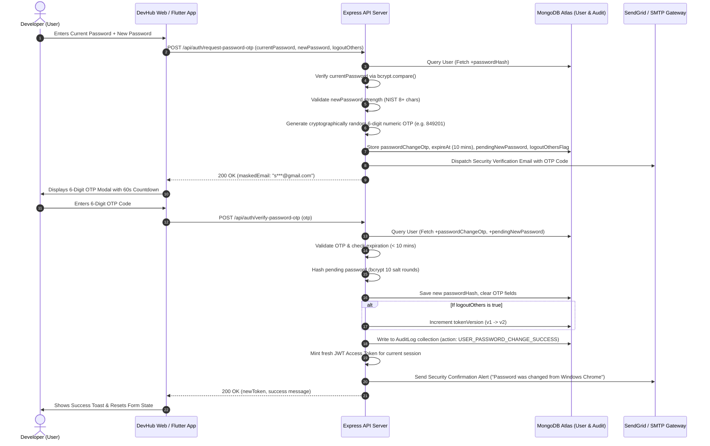
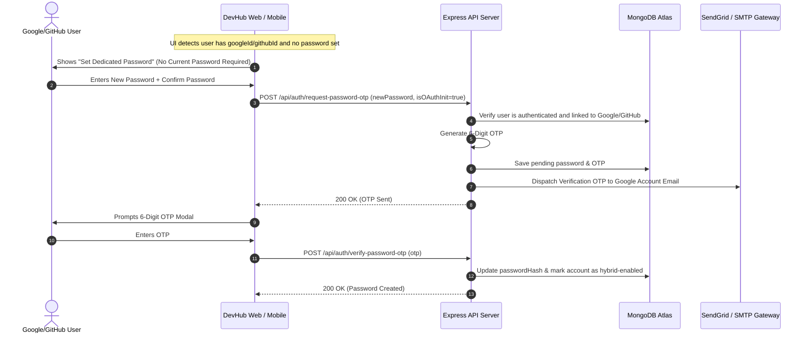
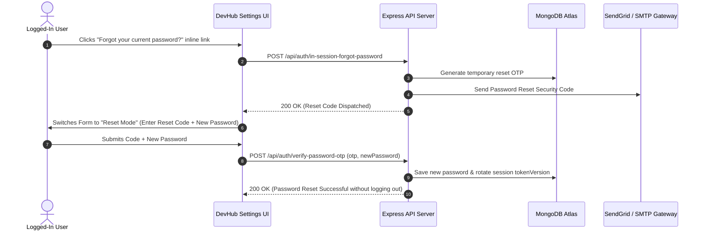

# 🛡️ DevHub Enterprise Password & Credential Lifecycle Architecture
### High-Assurance Authentication, Step-Up Verification, and Multi-Platform Session Invalidation
**Standards Compliance:** NIST SP 800-63B (Digital Identity Guidelines), Google Security Architecture, Meta Accounts Center (Instagram/Facebook), LinkedIn Security Standard.

---

## 1. Executive Summary & Industry Benchmarking

Enterprise consumer applications manage password changes not as a simple database update, but as a **high-risk cryptographic transaction** requiring step-up identity proofing, multi-device session invalidation, and comprehensive audit trails.

### Comparative Industry Matrix

| Security Feature | Google Account | Meta Accounts Center (IG/FB) | LinkedIn | DevHub Target Specification |
| :--- | :--- | :--- | :--- | :--- |
| **Re-Authentication Gate** | Mandatory (Passkey/Password) | Current Password Required | Current Password Required | **Dual Mode (Current Pass / OAuth Step-Up)** |
| **Step-Up Verification** | Device Prompt / SMS / Email | 2FA / Email OTP if anomaly | Email 6-Digit OTP Challenge | **Real-Time 6-Digit Email OTP Challenge** |
| **In-Session Recovery** | 1-Click Recovery Link | "Forgot your password?" inline | Inline Password Reset | **In-Place In-Session Reset (No Logout Needed)** |
| **Remote Session Invalidation** | Automatic Token Revocation | Optional Checkbox (Checked by default) | Optional Checkbox | **Selective/Global Multi-Device Killswitch ($O(1)$)** |
| **Audit Dispatch** | Immediate Push & Email Alert | Security Alert Email | Confirmation Email + IP info | **Rich HTML Alert with Telemetry & Emergency Lock** |
| **OAuth Hybrid Account Support** | Password Creation with Google Re-auth | Meta Linked Accounts Sync | OAuth Standalone Password Flow | **Seamless OAuth -> Standalone Password Transition** |

---

## 2. End-to-End Architectural Flows & Sequence Diagrams

### 2.1 Standard Password Change Flow (With Email OTP Step-Up)



---

### 2.2 Google / GitHub OAuth Users (Initial Password Creation)



---

### 2.3 In-Place / In-Session "Forgot Password?" Recovery (Instagram Style)



---

## 3. Database Schema Specification

### 3.1 `User` Model Extensions (`backend/src/models/User.js`)

```javascript
const userSchema = new mongoose.Schema(
  {
    // ... existing fields ...
    passwordHash: {
      type: String,
      select: false,
    },
    googleId: {
      type: String,
      unique: true,
      sparse: true,
    },
    githubId: {
      type: String,
      unique: true,
      sparse: true,
    },
    tokenVersion: {
      type: Number,
      default: 0,
    },
    
    // Enterprise Password Lifecycle State
    passwordChangeOtp: {
      type: String,
      select: false,
    },
    passwordChangeOtpExpire: {
      type: Date,
      select: false,
    },
    pendingNewPassword: {
      type: String,
      select: false,
    },
    pendingLogoutOthers: {
      type: Boolean,
      default: true,
      select: false,
    },
    lastPasswordChangeAt: {
      type: Date,
    },
    lastPasswordChangeIp: {
      type: String,
    },
    lastPasswordChangeUserAgent: {
      type: String,
    },
  },
  { timestamps: true }
);
```

---

## 4. Backend API Contract Specification

### Endpoint 1: `POST /api/auth/request-password-otp`
- **Access:** Private (Protected via JWT / HttpOnly cookie)
- **Rate Limit:** 3 requests per 10 minutes per IP/User
- **Request Body:**
  ```json
  {
    "currentPassword": "myOldPassword123!", // Optional for Google/GitHub OAuth accounts
    "newPassword": "myNewUltraSecurePassword456@",
    "logoutOtherDevices": true
  }
  ```
- **Response (200 OK):**
  ```json
  {
    "success": true,
    "message": "Security verification code sent to your email.",
    "emailMasked": "s***@gmail.com",
    "expiresInSeconds": 600
  }
  ```
- **Error Responses:**
  - `400 Bad Request`: `"Incorrect current password. Please try again."`
  - `400 Bad Request`: `"New password must be at least 6 characters long."`
  - `429 Too Many Requests`: `"Too many password requests. Please wait 10 minutes."`

---

### Endpoint 2: `POST /api/auth/verify-password-otp`
- **Access:** Private (Protected)
- **Request Body:**
  ```json
  {
    "otp": "849201"
  }
  ```
- **Response (200 OK):**
  ```json
  {
    "success": true,
    "message": "Password successfully updated! All other active sessions have been rotated.",
    "newToken": "eyJhbGciOiJIUzI1NiIsInR5cCI6IkpXVCJ9..."
  }
  ```
- **Error Responses:**
  - `400 Bad Request`: `"Invalid verification code. Please check your email and try again."`
  - `400 Bad Request`: `"Verification code has expired. Please request a new one."`

---

### Endpoint 3: `POST /api/auth/in-session-forgot-password`
- **Access:** Private (Protected)
- **Description:** For users who are logged in on their device but forgot their current password, allows initiating an instant reset OTP without logging out first.
- **Response (200 OK):**
  ```json
  {
    "success": true,
    "message": "Password reset code sent to your email."
  }
  ```

---

### Endpoint 4: `POST /api/auth/resend-password-otp`
- **Access:** Private (Protected)
- **Rate Limit:** 1 request per 60 seconds
- **Response (200 OK):**
  ```json
  {
    "success": true,
    "message": "New security verification code sent to your email."
  }
  ```

---

## 5. Security Emails Architecture & Content

### 1. Step-Up Verification OTP Email
- **Subject:** `DevHub Security Code: 849201 (Authorize Password Change)`
- **Header:** DevHub Identity & Cyan accent
- **Body Content:**
  - User greeting with display name.
  - Large monospace 6-digit code box (`#00F0FF` highlight).
  - Expiration note (10 minutes).
  - Security warning: *"If you did not make this request, your credentials may be compromised. Check active sessions immediately."*

### 2. Password Changed Security Alert Email (Google/Apple Style)
- **Subject:** `Security Alert: Your DevHub Password Was Changed`
- **Body Content:**
  - Timestamp (UTC & Local).
  - Device details (Browser, Operating System, Approximate IP Address).
  - Multi-device invalidation confirmation.
  - Emergency 1-click Security Revert / Lock Button.

---

## 6. Frontend UX & Component Architecture

### Component Hierarchy: `SecuritySettingsTab.jsx`

```
SecuritySettingsTab
 ├── IdentityOverviewCard (Avatar, Name, Email, Linked Auth Badge)
 ├── PasswordManagementCard
 │    ├── DynamicForm (OAuth Initial vs Standard Password Change)
 │    ├── CurrentPasswordInput (with "Forgot Password?" inline trigger)
 │    ├── NewPasswordInput + Real-Time 4-Tier Strength Bar
 │    ├── ConfirmPasswordInput + Match Indicator
 │    ├── LogoutOthersCheckbox (Checked by default)
 │    └── SubmitButton ("Send Security Verification Code")
 ├── InSessionForgotModal (If user forgot current password)
 ├── PasswordOtpModal (6-digit PIN input, 60s countdown timer, auto-focus)
 ├── ActiveSessionsCard (Remote killswitch)
 └── DangerZoneCard (Account Deletion)
```

---

## 7. 3-Tier Multi-Platform Parity (Web + Mobile App + Admin Panel)

1. **Web App (`frontend`):**
   - React 19, Lucide Icons, Framer Motion transitions, real-time input masks.
2. **Mobile App (`Flutter Native`):**
   - Direct integration with `POST /api/auth/request-password-otp` and `POST /api/auth/verify-password-otp`.
   - Native 6-pin input widget with SMS/Email auto-fill support.
3. **Admin Panel (`admin`):**
   - Audit Log stream displays `USER_PASSWORD_CHANGE_SUCCESS` with IP, timestamp, and token version rotation status.

---

*DevHub Global Engineering & Security Standard • Zero-Trust Identity Framework*
