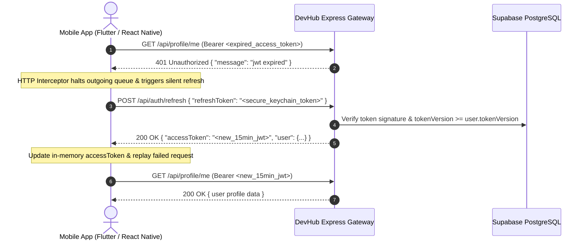

# 📱 DevHub Mobile Developer Complete API & Architecture Integration Specification (v2.0)

> **Document Classification:** Enterprise Production Mobile Integration Guide  
> **Target Platforms:** iOS Native (Swift/SwiftUI), Android Native (Kotlin/Jetpack Compose), Flutter, React Native / Expo  
> **Backend Engine:** Express 5.x Gateway + Prisma 7 ORM + Supabase PostgreSQL Multi-Session Cluster  
> **Base API URL:** `https://devhub-api-node.onrender.com/api`  
> **WebSocket Gateway:** `https://devhub-api-node.onrender.com`  

---

## 📑 Table of Contents
1. [Mobile Architecture & Security Fundamentals](#1-mobile-architecture--security-fundamentals)
2. [Token Lifecycle & Automatic Refresh Interceptor](#2-token-lifecycle--automatic-refresh-interceptor)
3. [Deep Linking & OAuth 2.0 Handshake](#3-deep-linking--oauth-20-handshake)
4. [Module 1: Complete Authentication & Identity APIs](#module-1-complete-authentication--identity-apis)
5. [Module 2: 4-Step Progressive Onboarding Wizard APIs](#module-2-4-step-progressive-onboarding-wizard-apis)
6. [Module 3: Profile & Experience Management APIs](#module-3-profile--experience-management-apis)
7. [Module 4: Home Feed & Post Interactions APIs](#module-4-home-feed--post-interactions-apis)
8. [Module 5: Global Peer Network & Connection APIs](#module-5-global-peer-network--connection-apis)
9. [Module 6: Real-Time Chat & Socket.IO Events](#module-6-real-time-chat--socketio-events)
10. [Module 7: Notifications & Activity Telemetry APIs](#module-7-notifications--activity-telemetry-apis)
11. [Module 8: Job Board & Opportunity Engine APIs](#module-8-job-board--opportunity-engine-apis)
12. [Module 9: Global Search & Discovery APIs](#module-9-global-search--discovery-apis)
13. [Ready-to-Use Mobile Code Templates (Flutter & React Native)](#13-ready-to-use-mobile-code-templates)

---

## 1. 🏛️ Mobile Architecture & Security Fundamentals

### 1.1. Security Storage Requirements
- **`accessToken` (Lifespan: 15 Minutes)**: Store in ephemeral memory/state (e.g. Redux / Riverpod / Bloc / Singleton).
- **`refreshToken` (Lifespan: 7 Days)**: Store exclusively in Hardware-Backed Encrypted Storage:
  - **iOS**: iOS Keychain (`kSecAttrAccessibleAfterFirstUnlock`).
  - **Android**: Android Keystore / `EncryptedSharedPreferences` (AES-256 GCM).
  - *Never store tokens in plain `AsyncStorage` or `SharedPreferences`.*

### 1.2. Global Request Headers
All protected API requests must include:
```http
Authorization: Bearer <accessToken>
Content-Type: application/json
Accept: application/json
User-Agent: DevHub-Mobile/2.0 (iOS; Version 18.2)
```

---

## 2. 🔄 Token Lifecycle & Automatic Refresh Interceptor

When an `accessToken` expires (after 15 minutes), the backend responds with `401 Unauthorized`. The mobile app must catch this with an HTTP Interceptor, silently refresh the token via `POST /api/auth/refresh`, update the in-memory token, and replay the failed request.



### 2.1. Instant Fleet Session Revocation (`tokenVersion`)
If a user resets their password or selects *"Log out of all other devices"*, Supabase increments `tokenVersion` (+1).
Any mobile device presenting an old token will receive:
```json
{
  "status": 401,
  "code": "SESSION_REVOKED",
  "message": "Session has been terminated. Please sign in again."
}
```
*Mobile App Action:* Clear Keychain, wipe in-memory state, navigate immediately to the Login screen with a toast notification.

---

## 3. 🌐 Deep Linking & OAuth 2.0 Handshake

### 3.1. Deep Link URI Scheme Configuration
Configure your mobile project to handle the custom URL scheme:
- **iOS (`Info.plist`)**:
  ```xml
  <key>CFBundleURLTypes</key>
  <array>
    <dict>
      <key>CFBundleURLSchemes</key>
      <array>
        <string>devhub</string>
      </array>
    </dict>
  </array>
  ```
- **Android (`AndroidManifest.xml`)**:
  ```xml
  <intent-filter>
    <action android:name="android.intent.action.VIEW" />
    <category android:name="android.intent.category.DEFAULT" />
    <category android:name="android.intent.category.BROWSABLE" />
    <data android:scheme="devhub" android:host="auth" android:path="/callback" />
  </intent-filter>
  ```

### 3.2. Launching In-App OAuth Browser
Open `ASWebAuthenticationSession` (iOS) or `Custom Tabs` (Android) with:
- **Google OAuth**: `https://devhub-api-node.onrender.com/api/auth/google?platform=mobile`
- **GitHub OAuth**: `https://devhub-api-node.onrender.com/api/auth/github?platform=mobile`

Upon user authentication, backend redirects to:
```
devhub://auth/callback?token=<accessToken>&refreshToken=<refreshToken>
```
Extract `token` and `refreshToken` from the URL parameters, save `refreshToken` to Keychain, and proceed to `/feed` or `/setup-profile`.

---

## Module 1: Complete Authentication & Identity APIs

### 1.1. User Registration (3-Minute OTP Dispatch)
- **Endpoint:** `POST /api/auth/register`
- **Request Body:**
```json
{
  "name": "Sarah Jenkins",
  "email": "sarah.jenkins@horizon.ai",
  "password": "UltraSecurePassword2026!"
}
```
- **Response (`201 Created`):**
```json
{
  "success": true,
  "message": "Verification code dispatched to your email (expires in 3 minutes).",
  "email": "sarah.jenkins@horizon.ai",
  "otpExpiresInSeconds": 180
}
```

---

### 1.2. Verify Registration OTP
- **Endpoint:** `POST /api/auth/verify-otp`
- **Request Body:**
```json
{
  "email": "sarah.jenkins@horizon.ai",
  "otp": "849201"
}
```
- **Response (`200 OK`):**
```json
{
  "success": true,
  "message": "Account verified successfully! Welcome to DevHub.",
  "accessToken": "eyJhbGciOiJIUzI1NiIsInR5cCI6IkpXVCJ9...",
  "refreshToken": "eyJhbGciOiJIUzI1NiIsInR5cCI6IkpXVCJ9...",
  "user": {
    "id": "a98f12c4-3d92-4e81-b541-19d28a4c5192",
    "name": "Sarah Jenkins",
    "email": "sarah.jenkins@horizon.ai",
    "avatarUrl": "https://cdn.pixabay.com/photo/2015/10/05/22/37/blank-profile-picture-973460_1280.png",
    "role": "user",
    "isVerified": true,
    "statusPreference": "online",
    "tokenVersion": 0
  }
}
```

---

### 1.3. Resend OTP (60-Second Cooldown & 3-Min Expiry)
- **Endpoint:** `POST /api/auth/resend-otp`
- **Request Body:**
```json
{
  "email": "sarah.jenkins@horizon.ai"
}
```
- **Response (`200 OK`):**
```json
{
  "success": true,
  "message": "New verification code sent to your email (valid for 3 minutes).",
  "otpExpiresInSeconds": 180
}
```
- **Rate Limit Response (`429 Too Many Requests`):**
```json
{
  "message": "Please wait 45 seconds before requesting another code.",
  "remainingSeconds": 45
}
```

---

### 1.4. User Login (3-Attempt 15-Minute Lockout)
- **Endpoint:** `POST /api/auth/login`
- **Request Body:**
```json
{
  "email": "sarah.jenkins@horizon.ai",
  "password": "UltraSecurePassword2026!"
}
```
- **Response (`200 OK`):**
```json
{
  "success": true,
  "message": "Signed in successfully",
  "accessToken": "eyJhbGciOiJIUzI1NiIsInR5cCI6IkpXVCJ9...",
  "refreshToken": "eyJhbGciOiJIUzI1NiIsInR5cCI6IkpXVCJ9...",
  "user": {
    "id": "a98f12c4-3d92-4e81-b541-19d28a4c5192",
    "name": "Sarah Jenkins",
    "email": "sarah.jenkins@horizon.ai",
    "avatarUrl": "https://cdn.pixabay.com/photo/...",
    "role": "user",
    "isVerified": true,
    "statusPreference": "online",
    "tokenVersion": 0
  }
}
```
- **Lockout Response (`429 Too Many Requests`):**
```json
{
  "code": "ACCOUNT_LOCKED",
  "message": "Account locked for 15 minutes due to 3 consecutive failed login attempts."
}
```

---

### 1.5. RFC 6749 Universal OAuth 2.0 Token Grant Gateway
- **Endpoint:** `POST /api/auth/oauth/token`
- **Password Grant Request Body:**
```json
{
  "grant_type": "password",
  "username": "sarah.jenkins@horizon.ai",
  "password": "UltraSecurePassword2026!"
}
```
- **Password Grant Response (`200 OK`):**
```json
{
  "token_type": "Bearer",
  "access_token": "eyJhbGciOiJIUzI1NiIsInR5cCI6IkpXVCJ9...",
  "expires_in": 900,
  "refresh_token": "eyJhbGciOiJIUzI1NiIsInR5cCI6IkpXVCJ9...",
  "user": {
    "id": "a98f12c4-3d92-4e81-b541-19d28a4c5192",
    "name": "Sarah Jenkins",
    "email": "sarah.jenkins@horizon.ai"
  }
}
```
- **Refresh Token Grant Request Body:**
```json
{
  "grant_type": "refresh_token",
  "refresh_token": "<stored_keychain_refresh_token>"
}
```
- **Refresh Token Grant Response (`200 OK`):**
```json
{
  "token_type": "Bearer",
  "access_token": "eyJhbGciOiJIUzI1NiIsInR5cCI6IkpXVCJ9...",
  "expires_in": 900,
  "refresh_token": "eyJhbGciOiJIUzI1NiIsInR5cCI6IkpXVCJ9..."
}
```

---

### 1.6. Smart Forgot Password (3-Min OTP Dispatch)
- **Endpoint:** `POST /api/auth/forgot-password`
- **Request Body:**
```json
{
  "email": "sarah.jenkins@horizon.ai"
}
```
- **Response (`200 OK`):**
```json
{
  "success": true,
  "message": "Password reset code sent to your registered email (valid for 3 minutes).",
  "email": "sarah.jenkins@horizon.ai",
  "otpExpiresInSeconds": 180
}
```

---

### 1.7. Reset Password (With Cross-Fleet Logout Toggle)
- **Endpoint:** `POST /api/auth/reset-password`
- **Request Body:**
```json
{
  "email": "sarah.jenkins@horizon.ai",
  "otp": "492018",
  "newPassword": "BrandNewSuperSecret2026!",
  "logoutOtherDevices": true
}
```
- **Response (`200 OK`):**
```json
{
  "success": true,
  "message": "Password reset successfully! All other active mobile and web sessions have been logged out.",
  "accessToken": "eyJhbGciOiJIUzI1NiIsInR5cCI6IkpXVCJ9...",
  "refreshToken": "eyJhbGciOiJIUzI1NiIsInR5cCI6IkpXVCJ9...",
  "user": {
    "id": "a98f12c4-3d92-4e81-b541-19d28a4c5192",
    "name": "Sarah Jenkins",
    "email": "sarah.jenkins@horizon.ai"
  }
}
```

---

### 1.8. Silent Token Refresh
- **Endpoint:** `POST /api/auth/refresh`
- **Request Body:**
```json
{
  "refreshToken": "<stored_keychain_refresh_token>"
}
```
- **Response (`200 OK`):**
```json
{
  "success": true,
  "accessToken": "eyJhbGciOiJIUzI1NiIsInR5cCI6IkpXVCJ9...",
  "user": {
    "id": "a98f12c4-3d92-4e81-b541-19d28a4c5192",
    "name": "Sarah Jenkins",
    "email": "sarah.jenkins@horizon.ai"
  }
}
```

---

### 1.9. Update Password (Logged-In / In-Session)
- **Endpoint:** `PUT /api/auth/updatepassword`
- **Headers:** `Authorization: Bearer <accessToken>`
- **Request Body:**
```json
{
  "currentPassword": "OldPassword123!",
  "newPassword": "NewPassword456@"
}
```
- **Response (`200 OK`):**
```json
{
  "success": true,
  "message": "Password updated. Other sessions revoked.",
  "accessToken": "eyJhbGciOiJIUzI1NiIsInR5cCI6IkpXVCJ9..."
}
```

---

### 1.10. Terminate All Fleet Sessions (Manual Killswitch)
- **Endpoint:** `POST /api/auth/revoke-all-sessions`
- **Headers:** `Authorization: Bearer <accessToken>`
- **Response (`200 OK`):**
```json
{
  "success": true,
  "message": "All active sessions on all devices terminated."
}
```

---

## Module 2: 4-Step Progressive Onboarding Wizard APIs

### 2.1. Step 1: Upload Avatar & Banner
- **Endpoint:** `POST /api/profile/upload-avatar` & `POST /api/profile/upload-banner`
- **Headers:** `Authorization: Bearer <accessToken>`, `Content-Type: multipart/form-data`
- **Form Data Field:** `avatar` / `banner` (Image File)
- **Response (`200 OK`):**
```json
{
  "success": true,
  "avatarUrl": "https://res.cloudinary.com/.../avatar_123.jpg"
}
```

---

### 2.2. Step 2: Headline, Bio & Primary Role
- **Endpoint:** `PUT /api/profile`
- **Headers:** `Authorization: Bearer <accessToken>`
- **Request Body:**
```json
{
  "headline": "Lead Systems Architect & Tech Founder",
  "bio": "Building scalable distributed intelligence and open-source neural systems.",
  "location": "San Francisco, CA",
  "website": "https://sarahjenkins.dev",
  "githubusername": "sjenkins"
}
```
- **Response (`200 OK`):**
```json
{
  "success": true,
  "profile": {
    "headline": "Lead Systems Architect & Tech Founder",
    "bio": "Building scalable distributed intelligence...",
    "location": "San Francisco, CA"
  }
}
```

---

### 2.3. Step 3: Skill Matrix & Open-to-Work Preferences
- **Endpoint:** `PUT /api/profile`
- **Headers:** `Authorization: Bearer <accessToken>`
- **Request Body:**
```json
{
  "skills": ["Rust", "TypeScript", "Distributed Systems", "AI / ML", "PostgreSQL", "Next.js"],
  "openToWork": {
    "isLooking": true,
    "jobTitles": ["Staff Systems Architect", "VP of Engineering"],
    "workplaces": ["Remote", "Hybrid"],
    "locations": ["San Francisco", "Worldwide Remote"]
  },
  "providingServices": {
    "isProviding": true,
    "services": ["System Architecture Consulting", "Seed Venture Advisory"],
    "details": "Available for select high-scale engineering advising."
  }
}
```
- **Response (`200 OK`):**
```json
{
  "success": true,
  "message": "Profile skills and services updated"
}
```

---

### 2.4. Step 4: Suggested Peer Connections
- **Endpoint:** `GET /api/profile/suggestions/onboarding`
- **Headers:** `Authorization: Bearer <accessToken>`
- **Response (`200 OK`):**
```json
{
  "success": true,
  "suggestions": [
    {
      "id": "user-uuid-1",
      "name": "David Kim",
      "headline": "Venture Partner @ Apex Capital",
      "avatarUrl": "https://images.unsplash.com/...",
      "mutualCount": 14,
      "sharedSkills": ["AI / ML", "Startups"]
    },
    {
      "id": "user-uuid-2",
      "name": "Elena Rostova",
      "headline": "Design Lead @ Studio Form",
      "avatarUrl": "https://images.unsplash.com/...",
      "mutualCount": 8,
      "sharedSkills": ["Design Systems"]
    }
  ]
}
```

---

## Module 3: Profile & Experience Management APIs

### 3.1. Get Current User Full Profile
- **Endpoint:** `GET /api/profile/me`
- **Headers:** `Authorization: Bearer <accessToken>`
- **Response (`200 OK`):**
```json
{
  "id": "a98f12c4-3d92-4e81-b541-19d28a4c5192",
  "name": "Sarah Jenkins",
  "email": "sarah.jenkins@horizon.ai",
  "avatarUrl": "https://images.unsplash.com/...",
  "bannerUrl": "https://images.unsplash.com/...",
  "headline": "Lead Systems Architect & Tech Founder",
  "bio": "Building scalable distributed intelligence...",
  "location": "San Francisco, CA",
  "skills": ["Rust", "TypeScript", "PostgreSQL", "AI / ML"],
  "stats": {
    "followersCount": 1420,
    "followingCount": 380,
    "connectionsCount": 890,
    "postsCount": 42
  },
  "experiences": [
    {
      "id": "exp-1",
      "title": "Head of Systems",
      "company": "Horizon AI",
      "location": "San Francisco, CA",
      "from": "2023-01-01T00:00:00.000Z",
      "current": true,
      "description": "Architecting multi-region low latency neural pipelines."
    }
  ],
  "educations": [
    {
      "id": "edu-1",
      "school": "Stanford University",
      "degree": "Master of Science",
      "fieldofstudy": "Computer Science",
      "from": "2018-09-01T00:00:00.000Z",
      "to": "2020-06-01T00:00:00.000Z"
    }
  ]
}
```

---

### 3.2. Add Experience / Education
- **Add Experience:** `POST /api/profile/experience`
  ```json
  {
    "title": "Staff Engineer",
    "company": "Vercel",
    "location": "Remote",
    "from": "2021-03-01",
    "to": "2022-12-31",
    "current": false,
    "description": "Led edge compute infrastructure."
  }
  ```
- **Delete Experience:** `DELETE /api/profile/experience/:exp_id`
- **Add Education:** `POST /api/profile/education`
- **Delete Education:** `DELETE /api/profile/education/:edu_id`

---

## Module 4: Home Feed & Post Interactions APIs

### 4.1. Get Paginated Home Feed
- **Endpoint:** `GET /api/posts?page=1&limit=10`
- **Headers:** `Authorization: Bearer <accessToken>`
- **Response (`200 OK`):**
```json
{
  "success": true,
  "posts": [
    {
      "id": "post-uuid-1",
      "content": "Just launched v2.4 of our neural inference engine! Benchmarking 10x faster latency across distributed nodes.",
      "codeSnippet": "export const useGlobalNetwork = () => { return { latency: '0.4ms' }; }",
      "mediaUrls": ["https://res.cloudinary.com/.../benchmark.png"],
      "likesCount": 1428,
      "commentsCount": 245,
      "repostsCount": 88,
      "isLikedByMe": true,
      "createdAt": "2026-08-21T14:30:00.000Z",
      "author": {
        "id": "user-uuid-1",
        "name": "Sarah Jenkins",
        "avatarUrl": "https://images.unsplash.com/...",
        "headline": "Lead Architect @ Horizon AI"
      }
    }
  ],
  "pagination": {
    "page": 1,
    "limit": 10,
    "hasMore": true
  }
}
```

---

### 4.2. Create Post
- **Endpoint:** `POST /api/posts`
- **Headers:** `Authorization: Bearer <accessToken>`
- **Request Body:**
```json
{
  "content": "Excited to share our newest architectural blueprint for distributed cache synchronization!",
  "codeSnippet": "const syncNode = async (cluster) => { ... }",
  "mediaUrls": ["https://res.cloudinary.com/.../diagram.png"],
  "tags": ["Architecture", "DistributedSystems", "OpenSource"]
}
```

---

### 4.3. Like / Unlike Post (Toggle)
- **Endpoint:** `POST /api/posts/:postId/like`
- **Headers:** `Authorization: Bearer <accessToken>`
- **Response (`200 OK`):**
```json
{
  "success": true,
  "isLiked": true,
  "likesCount": 1429
}
```

---

### 4.4. Comments Engine
- **Get Comments:** `GET /api/posts/:postId/comments?page=1&limit=20`
- **Add Comment:** `POST /api/posts/:postId/comments`
  ```json
  {
    "text": "Incredible benchmark results! How are you handling cache invalidation on edge nodes?"
  }
  ```

---

## Module 5: Global Peer Network & Connection APIs

### 5.1. Send Connection Request
- **Endpoint:** `POST /api/network/connect/:targetUserId`
- **Headers:** `Authorization: Bearer <accessToken>`
- **Response (`200 OK`):**
```json
{
  "success": true,
  "message": "Connection request sent successfully.",
  "status": "pending"
}
```

---

### 5.2. Accept / Reject Connection Request
- **Accept Request:** `PUT /api/network/accept/:connectionId`
- **Reject Request:** `DELETE /api/network/reject/:connectionId`
- **Get Connections List:** `GET /api/network/connections`
- **Get Pending Requests:** `GET /api/network/pending`

---

## Module 6: Real-Time Chat & Socket.IO Events

### 6.1. REST Endpoints
- **Get Conversations:** `GET /api/messages/conversations`
- **Get Chat History:** `GET /api/messages/:conversationId?page=1&limit=30`
- **Send Direct Message:** `POST /api/messages`
  ```json
  {
    "recipientId": "user-uuid-2",
    "text": "Hey David, would love to discuss the systems architecture proposal!",
    "mediaUrl": null
  }
  ```

### 6.2. Socket.IO Real-Time Protocol
- **Connect URL:** `https://devhub-api-node.onrender.com`
- **Auth Handshake:**
  ```javascript
  const socket = io('https://devhub-api-node.onrender.com', {
    auth: { token: accessToken },
    transports: ['websocket']
  });
  ```

| Event Name | Direction | Payload | Description |
| :--- | :--- | :--- | :--- |
| `join_user` | Client -> Server | `{ userId: "my-id" }` | Registers user's active socket room |
| `send_message` | Client -> Server | `{ conversationId, recipientId, text }` | Dispatches real-time message |
| `new_message` | Server -> Client | `{ message: {...}, conversationId }` | Fires on incoming message |
| `typing` | Client -> Server | `{ conversationId, recipientId }` | User is typing indicator |
| `user_typing` | Server -> Client | `{ userId, conversationId }` | Broadcasts typing animation |
| `user_online` | Server -> Client | `{ userId, status: "online" }` | Real-time presence indicator |

---

## Module 7: Notifications & Activity Telemetry APIs

### 7.1. Get Notifications & Unread Badge
- **Get Notifications:** `GET /api/notifications?page=1&limit=20`
- **Mark As Read:** `PUT /api/notifications/:id/read`
- **Mark All Read:** `PUT /api/notifications/read-all`
- **Unread Count:** `GET /api/notifications/unread-count` -> `{ "unreadCount": 5 }`

---

## Module 8: Job Board & Opportunity Engine APIs

### 8.1. Jobs Engine
- **List Jobs:** `GET /api/jobs?search=Architect&type=Full-time&remote=true&page=1`
- **Get Job Details:** `GET /api/jobs/:jobId`
- **Apply to Job:** `POST /api/jobs/:jobId/apply`
  ```json
  {
    "resumeUrl": "https://res.cloudinary.com/.../resume.pdf",
    "coverNote": "10+ years scaling low-latency systems."
  }
  ```

---

## Module 9: Global Search & Discovery APIs

### 9.1. Global Universal Search
- **Endpoint:** `GET /api/search?q=Neural&type=all` (type options: `all`, `users`, `posts`, `jobs`)
- **Response (`200 OK`):**
```json
{
  "success": true,
  "results": {
    "users": [ ... ],
    "posts": [ ... ],
    "jobs": [ ... ]
  }
}
```

---

## 13. 💻 Ready-to-Use Mobile Code Templates

### 13.1. Flutter (Dart) — Dio Interceptor with Token Refresh & Keychain

```dart
import 'package:dio/dio.dart';
import 'package:flutter_secure_storage/flutter_secure_storage.dart';

class DevHubApiClient {
  static final DevHubApiClient _instance = DevHubApiClient._internal();
  factory DevHubApiClient() => _instance;

  final Dio dio = Dio(BaseOptions(
    baseUrl: 'https://devhub-api-node.onrender.com/api',
    connectTimeout: const Duration(seconds: 15),
    receiveTimeout: const Duration(seconds: 15),
  ));

  final FlutterSecureStorage _storage = const FlutterSecureStorage();
  String? accessToken;

  DevHubApiClient._internal() {
    dio.interceptors.add(
      InterceptorsWrapper(
        onRequest: (options, handler) {
          if (accessToken != null) {
            options.headers['Authorization'] = 'Bearer $accessToken';
          }
          return handler.next(options);
        },
        onError: (DioException error, handler) async {
          // Catch 401 and handle silent token refresh
          if (error.response?.statusCode == 401 && error.requestOptions.path != '/auth/refresh') {
            final refreshToken = await _storage.read(key: 'devhub_refresh_token');
            if (refreshToken != null) {
              try {
                final refreshRes = await dio.post(
                  '/auth/refresh',
                  data: {'refreshToken': refreshToken},
                );

                if (refreshRes.statusCode == 200) {
                  accessToken = refreshRes.data['accessToken'];
                  
                  // Retry the original failed request with the new accessToken
                  final retryOptions = error.requestOptions;
                  retryOptions.headers['Authorization'] = 'Bearer $accessToken';
                  final retryResponse = await dio.fetch(retryOptions);
                  return handler.resolve(retryResponse);
                }
              } catch (refreshErr) {
                // If refresh token is revoked/invalid, force logout
                await _storage.delete(key: 'devhub_refresh_token');
                accessToken = null;
              }
            }
          }
          return handler.next(error);
        },
      ),
    );
  }
}
```

---

### 13.2. React Native (TypeScript) — Axios Interceptor with Keychain

```typescript
import axios from 'axios';
import * as Keychain from 'react-native-keychain';

let memoryAccessToken: string | null = null;

export const setAccessToken = (token: string | null) => {
  memoryAccessToken = token;
};

export const api = axios.create({
  baseURL: 'https://devhub-api-node.onrender.com/api',
  timeout: 15000,
});

api.interceptors.request.use((config) => {
  if (memoryAccessToken) {
    config.headers.Authorization = `Bearer ${memoryAccessToken}`;
  }
  return config;
});

api.interceptors.response.use(
  (response) => response,
  async (error) => {
    const originalRequest = error.config;

    if (error.response?.status === 401 && !originalRequest._retry && originalRequest.url !== '/auth/refresh') {
      originalRequest._retry = true;

      try {
        const credentials = await Keychain.getGenericPassword();
        if (credentials) {
          const refreshToken = credentials.password;
          const { data } = await axios.post('https://devhub-api-node.onrender.com/api/auth/refresh', {
            refreshToken,
          });

          memoryAccessToken = data.accessToken;
          originalRequest.headers.Authorization = `Bearer ${data.accessToken}`;
          return api(originalRequest);
        }
      } catch (err) {
        // Session Revoked / Expired -> Clear tokens
        await Keychain.resetGenericPassword();
        memoryAccessToken = null;
      }
    }
    return Promise.reject(error);
  }
);
```

---

## 🎯 Verification Checklist for Mobile Developers

- [ ] Configure `devhub://auth/callback` deep link handler in Xcode / Android Studio.
- [ ] Implement `FlutterSecureStorage` (iOS Keychain / Android Keystore) for storing the 7-day `refreshToken`.
- [ ] Implement HTTP Interceptor with silent 401 auto-renewal.
- [ ] Support the 4-step Progressive Onboarding Wizard (`/setup-profile`).
- [ ] Integrate Socket.io WebSocket connection for instant chat and notifications.
- [ ] Support `logoutOtherDevices` parameter during password reset.
