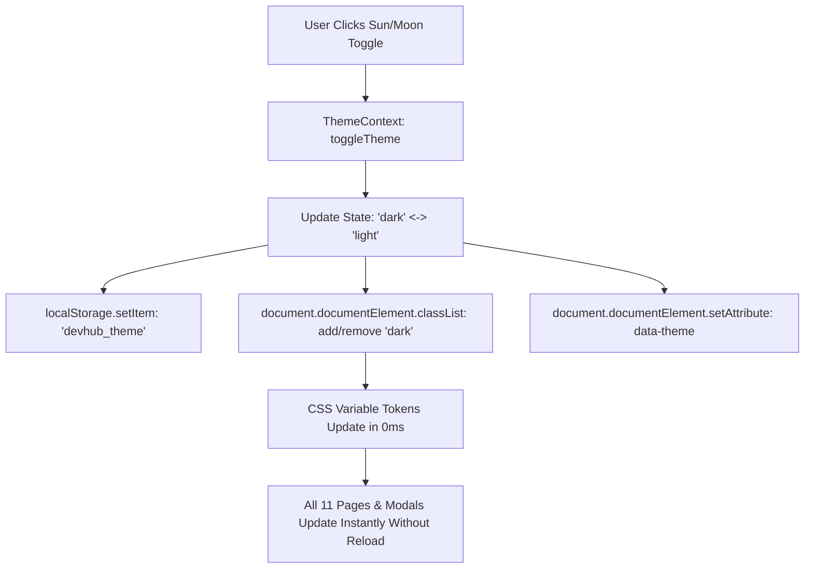

# 🌓 DevHub Enterprise Unified Theme System Specification
### Universal Dark Obsidian & Light Studio Theme Engine with Zero-Flicker Multi-Page Persistence
**Standard:** Linear / GitHub / Vercel Enterprise Token Architecture  
**Target:** 100% Seamless Real-Time Theme Switching Across Every Single Page, Modal, and Component in DevHub.

---

## 1. Executive Summary & Design System Philosophy

The DevHub Theme Engine provides two first-class visual experiences:
1. **Dark Obsidian (Default):** Premium deep `#0A0A0A` background, `#111116` surface cards, `#00F0FF` electric cyan accents, and high-contrast typography.
2. **Light Studio (New):** Clean `#F8FAFC` slate background, `#FFFFFF` crisp elevated cards, `#0284C7` / `#0088CC` deep ocean cyan accents, `#0F172A` deep typography, and subtle border shadows.

```
┌─────────────────────────────────────────────────────────────────────────────────────────────────────────────┐
│                            DEVHUB UNIFIED THEME ENGINE ARCHITECTURE                                         │
├───────────────────────────────────────┬─────────────────────────────────────────────────────────────────────┤
│ THEME MODE                            │ COLOR PALETTE & DESIGN TOKENS                                       │
├───────────────────────────────────────┼─────────────────────────────────────────────────────────────────────┤
│ 🌙 Dark Obsidian (Default)            │ • Background: `#0A0A0A`                                             │
│                                       │ • Surface / Cards: `#111116`                                        │
│                                       │ • Inner Subsurfaces: `#050508`                                      │
│                                       │ • Borders: `rgba(255, 255, 255, 0.08)`                              │
│                                       │ • Primary Text: `#FFFFFF`                                           │
│                                       │ • Secondary Text: `#9CA3AF`                                         │
│                                       │ • Brand Accent: `#00F0FF` (Electric Cyan)                           │
│                                       │ • Button Contrast: `#000000` text on `#00F0FF`                      │
├───────────────────────────────────────┼─────────────────────────────────────────────────────────────────────┤
│ ☀️ Light Studio (Clean Enterprise)    │ • Background: `#F8FAFC` (Slate 50)                                  │
│                                       │ • Surface / Cards: `#FFFFFF` (Pure White)                           │
│                                       │ • Inner Subsurfaces: `#F1F5F9` (Slate 100)                          │
│                                       │ • Borders: `#E2E8F0` / `rgba(0, 0, 0, 0.08)`                        │
│                                       │ • Primary Text: `#0F172A` (Slate 900)                               │
│                                       │ • Secondary Text: `#475569` (Slate 600)                             │
│                                       │ • Brand Accent: `#0284C7` (Ocean Cyan / Tech Blue)                  │
│                                       │ • Button Contrast: `#FFFFFF` text on `#0284C7`                      │
└───────────────────────────────────────┴─────────────────────────────────────────────────────────────────────┘
```

---

## 2. Technical Architecture & State Machine



### 2.1 Zero-Flicker HTML Head Bootstrap (`index.html`)
To prevent the "white flash" or "dark flash" on page reload, an inline script in `index.html` head evaluates the saved theme before the first DOM paint:

```html
<script>
  (function() {
    try {
      var saved = localStorage.getItem('devhub_theme');
      var prefersDark = window.matchMedia('(prefers-color-scheme: dark)').matches;
      if (saved === 'dark' || (!saved && prefersDark)) {
        document.documentElement.classList.add('dark');
        document.documentElement.setAttribute('data-theme', 'dark');
      } else {
        document.documentElement.classList.remove('dark');
        document.documentElement.setAttribute('data-theme', 'light');
      }
    } catch (e) {}
  })();
</script>
```

---

## 3. Global CSS Design Tokens (`index.css`)

```css
:root {
  /* Light Studio Tokens */
  --bg-primary: #F8FAFC;
  --bg-surface: #FFFFFF;
  --bg-surface-secondary: #F1F5F9;
  --bg-surface-hover: #E2E8F0;
  
  --border-subtle: #E2E8F0;
  --border-strong: #CBD5E1;
  
  --text-primary: #0F172A;
  --text-secondary: #475569;
  --text-muted: #94A3B8;
  
  --accent-primary: #0284C7;
  --accent-primary-hover: #0369A1;
  --accent-text: #FFFFFF;
  
  --card-shadow: 0 1px 3px 0 rgba(0, 0, 0, 0.05), 0 1px 2px -1px rgba(0, 0, 0, 0.05);
}

html.dark, [data-theme='dark'] {
  /* Dark Obsidian Tokens */
  --bg-primary: #0A0A0A;
  --bg-surface: #111116;
  --bg-surface-secondary: #050508;
  --bg-surface-hover: rgba(255, 255, 255, 0.05);
  
  --border-subtle: rgba(255, 255, 255, 0.08);
  --border-strong: rgba(255, 255, 255, 0.16);
  
  --text-primary: #FFFFFF;
  --text-secondary: #9CA3AF;
  --text-muted: #6B7280;
  
  --accent-primary: #00F0FF;
  --accent-primary-hover: rgba(0, 240, 255, 0.85);
  --accent-text: #000000;
  
  --card-shadow: 0 4px 20px -2px rgba(0, 0, 0, 0.6);
}
```

---

## 4. Toggle Placements (Accessible on Every Single Page)

1. **Top Navbar Header (`TopNavbar.jsx`):**
   - Quick 1-Click Sun / Moon Icon Button right next to Notifications icon!
   - Tooltip: `"Switch to Light Mode"` / `"Switch to Dark Mode"`.
2. **Profile Avatar Dropdown Menu (`TopNavbar.jsx`):**
   - Row: `[ 🌙 Dark Mode / ☀️ Light Mode ]` with live toggle switch.
3. **Mobile Drawer Menu (`MobileNav.jsx` / `Sidebar.jsx`):**
   - Quick theme toggle in footer.
4. **Settings Page:**
   - Appearance section to select `Dark Obsidian`, `Light Studio`, or `Sync with System`.

---

## 5. Scope: Every Single Page & Component

| Page / Component | Dark Mode Style | Light Mode Style |
| :--- | :--- | :--- |
| **1. Feed Page (`/`)** | `#0A0A0A` bg, `#111` cards, cyan badges | `#F8FAFC` bg, `#FFFFFF` cards, `#0284C7` badges |
| **2. Profile Page (`/profile`)** | Dark banner, obsidian cards, `#111` boxes | Clean white banner, white cards, slate borders |
| **3. Messages Page (`/messages`)** | `#111` chat list, `#050508` chat thread | `#FFF` chat list, `#F8FAFC` chat thread |
| **4. Jobs Page (`/jobs`)** | Dark job cards, obsidian filters | Clean white job cards, slate pill filters |
| **5. Network Page (`/network`)** | Dark connection grid & 3D network | White developer cards, crisp typography |
| **6. Settings Page (`/settings`)** | `#111` forms, dark inputs | `#FFF` forms, `#F8FAFC` crisp inputs |
| **7. Legal Center (`/guidelines`..)** | Dark markdown reader | Crisp white legal doc reader |
| **8. Notifications Page (`/notifications`)** | Dark alert stream | White alert stream with subtle borders |
| **9. Search Page (`/search`)** | Dark search results | White search results with highlighted matches |
| **10. TopNavbar & Sidebar** | `#0A0A0A` / `#111` glass blur | `#FFFFFF` frosted glass blur with border |
| **11. Modals & Popups** | `#111` modal overlays | `#FFFFFF` clean elevated modals |

---

## 6. Execution Roadmap

1. **Phase 1: Foundation & Context**:
   - Create `frontend/src/context/ThemeContext.jsx` with `theme`, `toggleTheme`, `setThemeMode`.
   - Update `frontend/src/main.jsx` / `App.jsx` to wrap with `ThemeProvider`.
   - Update `frontend/src/index.css` with unified CSS variables and Tailwind dark variants.
2. **Phase 2: Global Shell Toggles**:
   - Add Sun/Moon 1-click toggle to `TopNavbar.jsx`.
   - Add Theme switch to Avatar Dropdown and Sidebar.
3. **Phase 3: Page-by-Page Styling Pass**:
   - Ensure every page uses `bg-surface`, `text-primary`, `border-subtle` or `dark:` Tailwind classes so both themes look state-of-the-art!
4. **Phase 4: Verification & Git Deploy**:
   - Test toggle on all 11 pages.
   - Build frontend (`npm run build`).
   - Push to GitHub for live Vercel deploy!

---

*DevHub Global Engineering Standard • Universal Design System*
