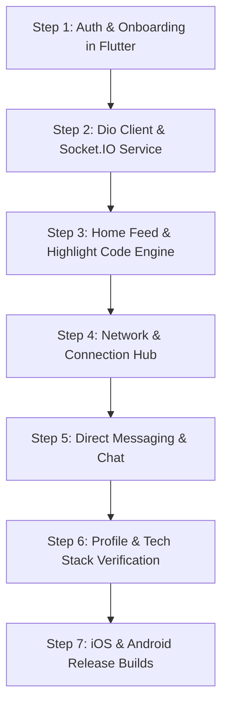

# 📱 DevHub Flutter Mobile App — Enterprise Architecture & API Synchronization Roadmap
> **LinkedIn-Grade Mobile Architecture & Full-Stack Synchronization Guide for Flutter & Dart**  
> *Target Platforms:* iOS & Android (Flutter 3.x / Dart 3.x)  
> *Backend Parity:* Node.js, Express.js, MongoDB (Mongoose), Socket.IO  
> *Design System:* Obsidian Dark (`#0A0A0A`), Neon Cyan (`#00F0FF`), Slate (`#94A3B8`)  
> *Architecture Pattern:* Feature-First Clean Architecture (Presentation, Domain, Data) with Riverpod / BLoC

---

## 📑 Table of Contents
1. [Flutter Enterprise Architecture & Tech Stack](#1-flutter-enterprise-architecture--tech-stack)
2. [Project Directory & Feature-First Structure](#2-project-directory--feature-first-structure)
3. [Dual Authentication & Token Sync Engine (Dio + SecureStorage)](#3-dual-authentication--token-sync-engine)
4. [Step-by-Step Implementation Roadmap (Phased Execution)](#4-step-by-step-implementation-roadmap)
   - [Phase 1: Authentication & Onboarding (Login, Register, OTP, OAuth)](#phase-1-authentication--onboarding)
   - [Phase 2: Global State, Network Client & Socket.IO Service](#phase-2-global-state-network-client--socketio-service)
   - [Phase 3: Core Social Feed & Syntax-Highlighted Code Engine](#phase-3-core-social-feed--syntax-highlighted-code-engine)
   - [Phase 4: Developer Network & Connections Engine](#phase-4-developer-network--connections-engine)
   - [Phase 5: Real-Time Direct Messaging & Chat Engine](#phase-5-real-time-direct-messaging--chat-engine)
   - [Phase 6: Developer Profile, Portfolio & Verification](#phase-6-developer-profile-portfolio--verification)
5. [Production Flutter Package Ecosystem (`pubspec.yaml`)](#5-production-flutter-package-ecosystem)
6. [Comprehensive Backend API Reference Dictionary](#6-comprehensive-backend-api-reference-dictionary)
7. [Real-Time WebSocket (Socket.IO) Protocol in Dart](#7-real-time-websocket-socketio-protocol-in-dart)
8. [Dart Models & JSON Serialization](#8-dart-models--json-serialization)
9. [Flutter Theme & Design System Tokens (`AppColors` & `AppTheme`)](#9-flutter-theme--design-system-tokens)

---

## 1. Flutter Enterprise Architecture & Tech Stack

```
┌─────────────────────────────────────────────────────────────────────────────┐
│                       DEVHUB FLUTTER MOBILE APP                             │
├──────────────────────┬───────────────────────────────┬──────────────────────┤
│  Presentation Layer  │      State & Domain Layer     │  Network & Data Layer│
├──────────────────────┼───────────────────────────────┼──────────────────────┤
│ • Auth (Login/Reg)   │ • Flutter Riverpod 2.x / BLoC │ • Dio HTTP Client    │
│ • Home Feed & Code   │ • Repository Pattern          │   (Bearer Intercept) │
│ • Network & Connect  │ • FlutterSecureStorage        │ • socket_io_client   │
│ • Direct Messages    │ • Hive (Offline Cache)        │ • Firebase Messaging │
│ • Profile & Portfolio│ • Optimistic UI Updaters      │ • flutter_highlight  │
└──────────────────────┴───────────────────────────────┴──────────────────────┘
                                    ▲
                                    │ (HTTPS REST + WSS WebSockets)
                                    ▼
┌─────────────────────────────────────────────────────────────────────────────┐
│                         DEVHUB BACKEND API SERVICES                         │
├─────────────────────────────────────────────────────────────────────────────┤
│  • Express.js 4.x REST APIs (Auth, Posts, Network, Messages, Profiles)     │
│  • JWT Dual-Auth Middleware (Authorization: Bearer + Cookie Fallback)       │
│  • Socket.IO Real-Time Gateway (Chat, Online Status, Live Notifications)   │
│  • MongoDB Replica Set / Mongoose 8.x ODM Layer                             │
│  • Cloudinary / Local Multi-part Upload Engines                              │
└─────────────────────────────────────────────────────────────────────────────┘
```

---

## 2. Project Directory & Feature-First Structure

```
devhub_flutter/
├── lib/
│   ├── main.dart
│   ├── app.dart
│   ├── core/
│   │   ├── constants/
│   │   │   ├── app_colors.dart         # #0A0A0A, #00F0FF, #121212
│   │   │   └── api_endpoints.dart      # Base URLs, Auth, Posts, Network paths
│   │   ├── network/
│   │   │   ├── dio_client.dart         # Dio instance + Bearer token interceptor
│   │   │   ├── error_interceptor.dart  # 401 unauth redirect, 500 handlers
│   │   │   └── socket_service.dart     # Socket.IO client gateway
│   │   ├── storage/
│   │   │   └── secure_storage.dart     # flutter_secure_storage wrapper
│   │   ├── theme/
│   │   │   ├── app_theme.dart          # Dark Obsidian ThemeData
│   │   │   └── text_styles.dart        # Inter & JetBrains Mono typography
│   │   └── utils/
│   │       ├── validators.dart         # Email/password form validation
│   │       └── date_formatter.dart     # 2h ago, Yesterday, DD/MM/YYYY
│   └── features/
│       ├── auth/
│       │   ├── data/ (auth_repository.dart, auth_api.dart)
│       │   ├── domain/ (user_model.dart, auth_state.dart)
│       │   └── presentation/ (login_screen.dart, register_screen.dart, verify_otp_screen.dart)
│       ├── feed/
│       │   ├── data/ (post_repository.dart)
│       │   ├── domain/ (post_model.dart, comment_model.dart)
│       │   └── presentation/ (feed_screen.dart, widgets/post_card.dart, widgets/code_snippet_box.dart)
│       ├── network/
│       │   ├── data/ (network_repository.dart)
│       │   ├── domain/ (connection_model.dart)
│       │   └── presentation/ (network_screen.dart, widgets/connection_card.dart)
│       ├── chat/
│       │   ├── data/ (chat_repository.dart)
│       │   ├── domain/ (message_model.dart, conversation_model.dart)
│       │   └── presentation/ (conversations_screen.dart, chat_room_screen.dart)
│       └── profile/
│           ├── data/ (profile_repository.dart)
│           ├── domain/ (profile_model.dart, experience_model.dart)
│           └── presentation/ (profile_screen.dart, widgets/tech_stack_chip.dart)
```

---

## 3. Dual Authentication & Token Sync Engine (Dio + SecureStorage)

### 1. `DioClient` with Automatic Bearer Token Interceptor
```dart
// lib/core/network/dio_client.dart
import 'package:dio/dio.dart';
import 'package:flutter_secure_storage/flutter_secure_storage.dart';

class DioClient {
  static const String baseUrl = 'https://api.devhub.net'; // or http://10.0.2.2:5000 for Android emulator
  final Dio dio;
  final FlutterSecureStorage secureStorage;

  DioClient({required this.secureStorage})
      : dio = Dio(
          BaseOptions(
            baseUrl: baseUrl,
            connectTimeout: const Duration(seconds: 15),
            receiveTimeout: const Duration(seconds: 15),
            headers: {
              'Content-Type': 'application/json',
              'Accept': 'application/json',
            },
          ),
        ) {
    dio.interceptors.add(
      InterceptorsWrapper(
        onRequest: (options, handler) async {
          // Read token from secure storage (iOS Keychain / Android KeyStore)
          final token = await secureStorage.read(key: 'jwt_token');
          if (token != null && token.isNotEmpty) {
            options.headers['Authorization'] = 'Bearer $token';
          }
          return handler.next(options);
        },
        onError: (DioException error, handler) async {
          if (error.response?.statusCode == 401) {
            // Auto logout / token expired
            await secureStorage.delete(key: 'jwt_token');
            // Navigate to LoginScreen via global event
          }
          return handler.next(error);
        },
      ),
    );
  }
}
```

---

## 4. Step-by-Step Implementation Roadmap



### Phase 1: Authentication & Onboarding
*Target Milestone: 100% secure native Flutter authentication matching web app.*

1. **Login Screen (`lib/features/auth/presentation/login_screen.dart`):**
   - Clean dark `#0A0A0A` background with ambient glowing cyan gradient.
   - TextFormFields with `prefixIcon: Icon(LucideIcons.mail)`, `LucideIcons.lock`.
   - Glowing Neon Cyan CTA button: `ElevatedButton` with `#00F0FF` background and black bold text.
   - Social OAuth buttons: Google Sign-In (`google_sign_in`) & GitHub OAuth Webview (`flutter_custom_tabs`).
   - If response status is `403` with `isVerified: false`, navigate to `VerifyOtpScreen(email)`.

2. **Register Screen (`lib/features/auth/presentation/register_screen.dart`):**
   - Full Name, Email, Password form fields with real-time validation.
   - Blocks disposable emails (matching backend blacklist).
   - On success, displays `SnackBar` ("OTP sent to email") and pushes to `VerifyOtpScreen`.

3. **Verify OTP Screen (`lib/features/auth/presentation/verify_otp_screen.dart`):**
   - 6-box OTP input with auto-focus (`pinput` package).
   - 5-minute countdown timer + Resend OTP button.
   - Saves `token` into `FlutterSecureStorage` and sets `AuthState.authenticated`.

---

### Phase 2: Global State, Network Client & Socket.IO Service
*Target Milestone: Real-time event streaming in Dart.*

1. **Socket.IO Client Setup (`lib/core/network/socket_service.dart`):**
```dart
import 'package:socket_io_client/socket_io_client.dart' as IO;

class SocketService {
  late IO.Socket socket;

  void initSocket(String token, String userId) {
    socket = IO.io(
      'https://api.devhub.net',
      IO.OptionBuilder()
          .setTransports(['websocket'])
          .enableAutoConnect()
          .setAuth({'token': token})
          .build(),
    );

    socket.onConnect((_) {
      print('🟢 Connected to DevHub Socket Gateway');
      socket.emit('join', userId);
    });

    socket.on('newNotification', (data) {
      // Trigger local in-app banner toast
    });

    socket.on('newMessage', (data) {
      // Append message to active chat room
    });
  }

  void dispose() {
    socket.disconnect();
    socket.dispose();
  }
}
```

---

### Phase 3: Core Social Feed & Syntax-Highlighted Code Engine
*Target Milestone: 60 FPS scrolling feed with native code syntax highlighting.*

1. **Feed Screen (`lib/features/feed/presentation/feed_screen.dart`):**
   - Custom `SliverAppBar` with DevHub logo, Search bar, and Bell icon (with unread badge).
   - `RefreshIndicator` (Pull-to-Refresh) + `ListView.builder` with pagination controller.

2. **Code Snippet Box (`lib/features/feed/presentation/widgets/code_snippet_box.dart`):**
   - Uses `flutter_highlight` with `vs2015Theme` or `atomOneDarkTheme`.
   - Top bar with language tag (e.g. `rust`, `typescript`, `python`), copy code button (`Clipboard.setData`), and macOS traffic dots (🔴 🟡 🟢).

3. **Post Interaction Bar:**
   - Optimistic Likes (`❤️` with instant counter increment).
   - Repost modal (`🔁`).
   - Bookmarks toggle (`🔖`).
   - Share sheet (`share_plus` package).

---

### Phase 4: Developer Network & Connections Engine
*Target Milestone: LinkedIn-style network growth and connection management.*

1. **Network Screen (`lib/features/network/presentation/network_screen.dart`):**
   - Segmented TabBar: `Grow Network` | `Invitations` | `Connections`.
2. **Developer Card Widget (`connection_card.dart`):**
   - Cached avatar (`cached_network_image`) with online status green dot (`#10B981`).
   - Name, Verified badge, Developer Title, Mutual connections counter.
   - Connect CTA: `#00F0FF` filled button with loading state.

---

### Phase 5: Real-Time Direct Messaging & Chat Engine
*Target Milestone: Low-latency 1-to-1 conversation with code sharing.*

1. **Conversations Screen (`conversations_screen.dart`):**
   - List of active chats with last message preview, timestamp, unread counter, and active status.
2. **Chat Room Screen (`chat_room_screen.dart`):**
   - Header with peer avatar, name, verified badge, and `🟢 Active Now` status.
   - Message bubbles:
     - Sent: Neon Cyan `#00F0FF` container with black text.
     - Received: Surface Card `#121212` container with white text.
     - Code attachment blocks with copy button.
   - Live typing indicator (`typing` and `stop_typing` socket emitters).

---

### Phase 6: Developer Profile, Portfolio & Verification
*Target Milestone: Showcase developer skills, repositories, and experience.*

1. **Profile Screen (`profile_screen.dart`):**
   - Header banner + Circular avatar with glowing neon cyan border.
   - Verified check badge, full name, headline, location, and mutual count.
   - Stats row: `Connections`, `Posts`, `Repositories`.
2. **Verified Tech Stack Chips:**
   - Pill chips: `React Native`, `Flutter`, `TypeScript`, `Node.js`, `Rust`, `Docker`.
3. **Pinned Repositories:**
   - GitHub-style cards with star counter (★ 3.4k) and language indicator.

---

## 5. Production Flutter Package Ecosystem (`pubspec.yaml`)

```yaml
dependencies:
  flutter:
    sdk: flutter

  # State Management
  flutter_riverpod: ^2.5.1
  
  # Networking & Real-Time
  dio: ^5.4.3+1
  socket_io_client: ^2.0.3+1
  
  # Security & Storage
  flutter_secure_storage: ^9.2.2
  shared_preferences: ^2.2.3
  
  # Code Syntax Highlighting
  flutter_highlight: ^0.7.0
  
  # UI, Icons & Typography
  google_fonts: ^6.2.1
  lucide_icons: ^0.257.0
  cached_network_image: ^3.3.1
  pinput: ^4.0.0            # 6-Digit OTP Box
  shimmer: ^3.0.0           # Skeleton Loading
  flutter_svg: ^2.0.10+1
  
  # Utilities & Helpers
  intl: ^0.19.0             # Date formatting
  share_plus: ^9.0.0        # Native Share Sheet
  url_launcher: ^6.2.6      # External links
```

---

## 6. Comprehensive Backend API Reference Dictionary

### 🔐 Authentication Endpoints (`/api/auth`)

| Method | Endpoint | Auth Required | Request Body | Success Response (200/201) | Error Codes |
| :--- | :--- | :--- | :--- | :--- | :--- |
| `POST` | `/api/auth/register` | No | `{ "name": "...", "email": "...", "password": "..." }` | `{ "message": "Verification OTP sent", "email": "..." }` | `400` (Validation / Disposable Email), `500` |
| `POST` | `/api/auth/verify-otp` | No | `{ "email": "...", "otp": "123456" }` | `{ "_id": "...", "name": "...", "email": "...", "role": "...", "token": "eyJ..." }` | `400` (Invalid OTP), `403` (Locked), `404` |
| `POST` | `/api/auth/resend-otp` | No | `{ "email": "..." }` | `{ "message": "New OTP sent to email" }` | `400`, `403` (Locked), `404` |
| `POST` | `/api/auth/login` | No | `{ "email": "...", "password": "..." }` | `{ "_id": "...", "name": "...", "email": "...", "role": "...", "token": "eyJ..." }` | `401` (Invalid creds), `403` (Unverified/Locked) |
| `POST` | `/api/auth/logout` | Yes | — | `{ "message": "Signed out successfully" }` | `401` |
| `GET` | `/api/auth/me` | Yes | — | `{ "_id": "...", "name": "...", "email": "...", "avatar": { "url": "..." }, "statusPreference": "online" }` | `401`, `403` (Suspended) |

---

### 📰 Posts & Social Feed Endpoints (`/api/posts`)

| Method | Endpoint | Auth Required | Query / Body | Success Response | Description |
| :--- | :--- | :--- | :--- | :--- | :--- |
| `GET` | `/api/posts` | Yes | `?page=1&limit=20` | `[ PostObject, ... ]` | Paginated feed |
| `POST` | `/api/posts` | Yes | `{ "content": "...", "codeSnippet": { "code": "...", "language": "rust" } }` | `PostObject` | Create new post |
| `PUT` | `/api/posts/:id/like` | Yes | — | `{ "likes": ["id1", "id2"], "likesCount": 2 }` | Toggle like |
| `POST` | `/api/posts/:id/repost` | Yes | `{ "thoughts": "..." }` | `PostObject` | Repost to feed |
| `POST` | `/api/posts/:id/comments` | Yes | `{ "content": "..." }` | `CommentObject` | Add comment |

---

### 👥 Network & Connections Endpoints (`/api/network`)

| Method | Endpoint | Auth Required | Body | Success Response | Description |
| :--- | :--- | :--- | :--- | :--- | :--- |
| `GET` | `/api/network/connections` | Yes | — | `[ UserSummary, ... ]` | Confirmed connections |
| `GET` | `/api/network/pending` | Yes | — | `{ "received": [...], "sent": [...] }` | Pending requests |
| `GET` | `/api/network/suggestions`| Yes | — | `[ UserSummary, ... ]` | Recommended developers |
| `POST` | `/api/network/connect/:id`| Yes | — | `{ "message": "Connection request sent" }` | Send connection request |
| `PUT` | `/api/network/accept/:id` | Yes | — | `{ "message": "Connection accepted" }` | Accept connection request |

---

### 💬 Messaging Endpoints (`/api/messages`)

| Method | Endpoint | Auth Required | Body | Success Response | Description |
| :--- | :--- | :--- | :--- | :--- | :--- |
| `GET` | `/api/messages/conversations` | Yes | — | `[ ConversationSummary, ... ]` | All active chat threads |
| `GET` | `/api/messages/:convoId` | Yes | `?page=1&limit=50` | `[ MessageObject, ... ]` | Message history |
| `POST` | `/api/messages/send` | Yes | `{ "receiverId": "...", "text": "...", "codeSnippet": { ... } }` | `MessageObject` | Send message |

---

## 7. Real-Time WebSocket (Socket.IO) Protocol in Dart

### 📡 Client Emitters (Flutter App ➔ Server)

```dart
// Register User Room
socket.emit('join', currentUserId);

// Send Instant Message
socket.emit('sendMessage', {
  'receiverId': targetUserId,
  'text': 'Hey, check out this Flutter widget architecture!',
  'codeSnippet': {
    'code': 'class MyWidget extends StatelessWidget { ... }',
    'language': 'dart',
  },
});

// Typing Indicators
socket.emit('typing', { 'conversationId': convoId, 'receiverId': peerId });
socket.emit('stop_typing', { 'conversationId': convoId, 'receiverId': peerId });
```

### 📥 Server Listeners (Server ➔ Flutter App)

```dart
socket.on('newMessage', (data) {
  final message = MessageModel.fromJson(data);
  // Add to active chat stream and scroll to bottom
});

socket.on('newNotification', (data) {
  // Show in-app banner toast notification + increment unread badge
});

socket.on('user_online', (data) {
  final userId = data['userId'];
  // Set online presence dot to green
});
```

---

## 8. Dart Models & JSON Serialization

```dart
// lib/features/auth/domain/user_model.dart
class UserModel {
  final String id;
  final String name;
  final String email;
  final String role;
  final String? avatarUrl;
  final bool isVerified;
  final String statusPreference;

  UserModel({
    required this.id,
    required this.name,
    required this.email,
    required this.role,
    this.avatarUrl,
    required this.isVerified,
    required this.statusPreference,
  });

  factory UserModel.fromJson(Map<String, dynamic> json) {
    return UserModel(
      id: json['_id'] ?? '',
      name: json['name'] ?? '',
      email: json['email'] ?? '',
      role: json['role'] ?? 'user',
      avatarUrl: json['avatar']?['url'],
      isVerified: json['isVerified'] ?? false,
      statusPreference: json['statusPreference'] ?? 'online',
    );
  }

  Map<String, dynamic> toJson() => {
    '_id': id,
    'name': name,
    'email': email,
    'role': role,
    'statusPreference': statusPreference,
  };
}

// lib/features/feed/domain/post_model.dart
class CodeSnippetModel {
  final String code;
  final String language;

  CodeSnippetModel({required this.code, required this.language});

  factory CodeSnippetModel.fromJson(Map<String, dynamic> json) {
    return CodeSnippetModel(
      code: json['code'] ?? '',
      language: json['language'] ?? 'javascript',
    );
  }
}

class PostModel {
  final String id;
  final UserModel author;
  final String content;
  final CodeSnippetModel? codeSnippet;
  final List<String> likes;
  final int likesCount;
  final int commentsCount;
  final int repostsCount;
  final DateTime createdAt;

  PostModel({
    required this.id,
    required this.author,
    required this.content,
    this.codeSnippet,
    required this.likes,
    required this.likesCount,
    required this.commentsCount,
    required this.repostsCount,
    required this.createdAt,
  });

  factory PostModel.fromJson(Map<String, dynamic> json) {
    return PostModel(
      id: json['_id'] ?? '',
      author: UserModel.fromJson(json['author'] ?? {}),
      content: json['content'] ?? '',
      codeSnippet: json['codeSnippet'] != null
          ? CodeSnippetModel.fromJson(json['codeSnippet'])
          : null,
      likes: List<String>.from(json['likes'] ?? []),
      likesCount: json['likesCount'] ?? 0,
      commentsCount: json['commentsCount'] ?? 0,
      repostsCount: json['reposts']?.length ?? 0,
      createdAt: DateTime.tryParse(json['createdAt'] ?? '') ?? DateTime.now(),
    );
  }
}
```

---

## 9. Flutter Theme & Design System Tokens (`AppColors` & `AppTheme`)

```dart
// lib/core/theme/app_colors.dart
import 'package:flutter/material.dart';

class AppColors {
  static const Color background = Color(0xFF0A0A0A);
  static const Color surfaceCard = Color(0xFF121212);
  static const Color codeBackground = Color(0xFF050505);
  
  // Neon Accents
  static const Color cyanNeon = Color(0xFF00F0FF);
  static const Color cyanNeonGlow = Color(0x6600F0FF);
  
  // Status Colors
  static const Color onlineGreen = Color(0xFF10B981);
  static const Color destructiveRed = Color(0xFFEF4444);
  static const Color amberStars = Color(0xFFF59E0B);
  
  // Typography Colors
  static const Color textPrimary = Color(0xFFFFFFFF);
  static const Color textSecondary = Color(0xFF94A3B8);
  static const Color textMuted = Color(0xFF64748B);
  
  // Borders
  static const Color borderSubtle = Color(0x14FFFFFF); // white/8%
}

// lib/core/theme/app_theme.dart
import 'package:flutter/material.dart';
import 'package:google_fonts/google_fonts.dart';
import 'app_colors.dart';

class AppTheme {
  static ThemeData get darkTheme {
    return ThemeData(
      brightness: Brightness.dark,
      scaffoldBackgroundColor: AppColors.background,
      primaryColor: AppColors.cyanNeon,
      textTheme: GoogleFonts.interTextTheme(
        ThemeData.dark().textTheme.apply(
          bodyColor: AppColors.textPrimary,
          displayColor: AppColors.textPrimary,
        ),
      ),
      appBarTheme: const AppBarTheme(
        backgroundColor: AppColors.background,
        elevation: 0,
        centerTitle: false,
        iconTheme: IconThemeData(color: AppColors.textPrimary),
      ),
      inputDecorationTheme: InputDecorationTheme(
        filled: true,
        fillColor: AppColors.surfaceCard,
        border: OutlineInputBorder(
          borderRadius: BorderRadius.circular(12),
          borderSide: const BorderSide(color: AppColors.borderSubtle),
        ),
        focusedBorder: OutlineInputBorder(
          borderRadius: BorderRadius.circular(12),
          borderSide: const BorderSide(color: AppColors.cyanNeon, width: 1.5),
        ),
        hintStyle: const TextStyle(color: AppColors.textMuted, fontSize: 14),
      ),
      elevatedButtonTheme: ElevatedButtonThemeData(
        style: ElevatedButton.styleFrom(
          backgroundColor: AppColors.cyanNeon,
          foregroundColor: Colors.black,
          shape: RoundedRectangleBorder(borderRadius: BorderRadius.circular(12)),
          padding: const EdgeInsets.symmetric(vertical: 14, horizontal: 20),
          textStyle: const TextStyle(fontSize: 15, fontWeight: FontWeight.bold),
        ),
      ),
    );
  }
}
```

---

## 10. Next Step Execution Checklist (Starting with Auth)

- [x] **Backend Ready:** Dual `Bearer` header + `Cookie` token support verified in `authMiddleware.js` and `authController.js`.
- [ ] **Step 1 (Flutter Setup):** Create Flutter project (`flutter create devhub_mobile`) & install `pubspec.yaml` dependencies.
- [ ] **Step 2 (Core Setup):** Add `AppColors`, `AppTheme`, `DioClient`, and `FlutterSecureStorage`.
- [ ] **Step 3 (Auth Implementation):** Implement `LoginScreen`, `RegisterScreen`, and `VerifyOtpScreen`.
- [ ] **Step 4 (Handshake Verification):** Test login with real backend (`/api/auth/login`) and verify token save in SecureStorage.
