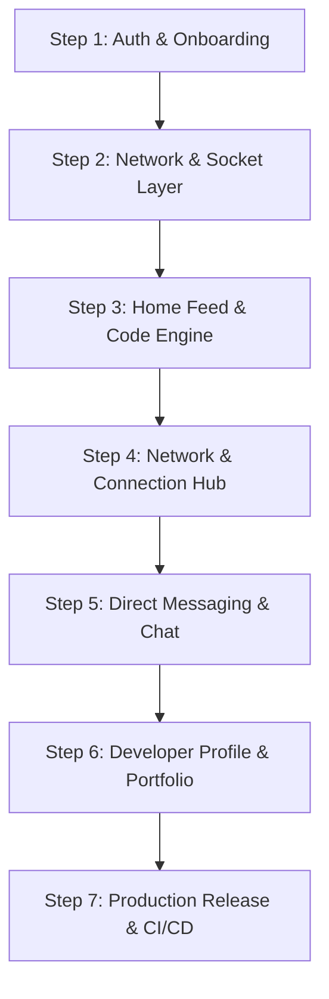

# 📱 DevHub Mobile App — Enterprise Architecture & API Synchronization Roadmap
> **LinkedIn-Grade Mobile Architecture & Full-Stack Synchronization Guide**  
> *Target Platforms:* iOS & Android (React Native / Expo / Native)  
> *Backend Parity:* Node.js, Express.js, MongoDB (Mongoose), Socket.IO  
> *Design System:* Obsidian Dark (`#0A0A0A`), Neon Cyan (`#00F0FF`), Slate (`#94A3B8`)

---

## 📑 Table of Contents
1. [Enterprise Architecture Overview](#1-enterprise-architecture-overview)
2. [Dual Authentication & Token Sync Engine (Web + Mobile Parity)](#2-dual-authentication--token-sync-engine)
3. [Step-by-Step Implementation Roadmap (Phased Execution)](#3-step-by-step-implementation-roadmap)
   - [Phase 1: Authentication & Onboarding (Login, Register, OTP, OAuth)](#phase-1-authentication--onboarding)
   - [Phase 2: Global State, Network Client & Socket Layer](#phase-2-global-state-network-client--socket-layer)
   - [Phase 3: Core Social Feed & Code Engine](#phase-3-core-social-feed--code-engine)
   - [Phase 4: Developer Network & Connections Engine](#phase-4-developer-network--connections-engine)
   - [Phase 5: Real-Time Direct Messaging & Chat Engine](#phase-5-real-time-direct-messaging--chat-engine)
   - [Phase 6: Developer Profile, Portfolio & Verification](#phase-6-developer-profile-portfolio--verification)
4. [Comprehensive Backend API Reference Dictionary](#4-comprehensive-backend-api-reference-dictionary)
5. [Real-Time WebSocket (Socket.IO) Protocol Dictionary](#5-real-time-websocket-protocol-dictionary)
6. [TypeScript Interfaces & Schema Synchronization](#6-typescript-interfaces--schema-synchronization)
7. [Mobile Design System & Component Library Tokens](#7-mobile-design-system--component-library-tokens)

---

## 1. Enterprise Architecture Overview

The DevHub Mobile Application is structured as an **offline-first, real-time social & developer networking platform** built to match the high-performance standards of LinkedIn, GitHub Mobile, and Twitter/X.

```
┌─────────────────────────────────────────────────────────────────────────────┐
│                           DEVHUB MOBILE CLIENT                              │
├──────────────────────┬───────────────────────────────┬──────────────────────┤
│  UI / Screen Layer   │      State & Data Layer       │  Network & Real-time │
├──────────────────────┼───────────────────────────────┼──────────────────────┤
│ • Auth (Login/Reg)   │ • Zustand (Auth & Feed Store) │ • Axios API Client   │
│ • Home Feed & Code   │ • TanStack React Query        │   (Bearer Intercept) │
│ • Network & Connect  │ • Expo SecureStore / Keychain │ • Socket.IO Client   │
│ • Direct Messages    │ • AsyncStorage (Cache)        │ • Background Sync    │
│ • Profile & Portfolio│ • Optimistic UI Updaters      │ • Push Notifications │
└──────────────────────┴───────────────────────────────┴──────────────────────┘
                                    ▲
                                    │ (HTTPS REST + WSS WebSockets)
                                    ▼
┌─────────────────────────────────────────────────────────────────────────────┐
│                         DEVHUB BACKEND API SERVICES                         │
├─────────────────────────────────────────────────────────────────────────────┤
│  • Express.js 4.x REST APIs (Auth, Posts, Network, Messages, Profiles)     │
│  • JWT Dual-Auth Middleware (Authorization: Bearer + Cookie Fallback)       │
│  • Socket.IO Real-Time Gateway (Chat, Online Status, Live Notifications)   │
│  • MongoDB Replica Set / Mongoose 8.x ODM Layer                             │
│  • Cloudinary / Local Multi-part Upload Engines                              │
└─────────────────────────────────────────────────────────────────────────────┘
```

---

## 2. Dual Authentication & Token Sync Engine

### The Problem & Solution
- **Web App:** Relies on `httpOnly` cookies (`res.cookie('jwt', accessToken)`).
- **Mobile App (iOS/Android):** Cross-origin cookie management is unreliable across native network stacks. Industry standard is **Secure Key Storage + Authorization Bearer Header**.

### Backend Parity Update Required (`authMiddleware.js`)
To support both Web and Mobile simultaneously without breaking existing web functionality:

```javascript
// backend/src/middleware/authMiddleware.js
const protect = async (req, res, next) => {
  let token;

  // 1. Check Authorization Header (Standard for Mobile Apps)
  if (req.headers.authorization && req.headers.authorization.startsWith('Bearer')) {
    token = req.headers.authorization.split(' ')[1];
  } 
  // 2. Fallback to Cookie (Standard for Web App)
  else if (req.cookies && req.cookies.jwt) {
    token = req.cookies.jwt;
  }

  if (!token) {
    return res.status(401).json({ message: 'Not authorized, no token provided' });
  }

  try {
    const decoded = jwt.verify(token, process.env.JWT_ACCESS_SECRET);
    req.user = await User.findById(decoded.id).select('-passwordHash');

    if (!req.user) {
      return res.status(401).json({ message: 'Not authorized, user not found' });
    }

    if (req.user.isSuspended) {
      return res.status(403).json({ message: 'Your account has been suspended.' });
    }

    next();
  } catch (error) {
    return res.status(401).json({ message: 'Not authorized, token invalid or expired' });
  }
};
```

### Mobile Axios Client Interceptor Setup (`apiClient.ts`)
```typescript
import axios from 'axios';
import * as SecureStore from 'expo-secure-store';

const API_BASE_URL = 'https://api.devhub.net'; // or http://10.0.2.2:5000 for Android emulator

export const apiClient = axios.create({
  baseURL: API_BASE_URL,
  timeout: 15000,
  headers: {
    'Content-Type': 'application/json',
    'Accept': 'application/json',
  },
});

// Attach JWT Token to every outgoing request
apiClient.interceptors.request.use(async (config) => {
  const token = await SecureStore.getItemAsync('user_token');
  if (token) {
    config.headers.Authorization = `Bearer ${token}`;
  }
  return config;
}, (error) => Promise.reject(error));

// Global Response Interceptor for 401 handling (Auto-logout / Refresh)
apiClient.interceptors.response.use(
  (response) => response,
  async (error) => {
    if (error.response?.status === 401) {
      await SecureStore.deleteItemAsync('user_token');
      // Trigger navigation to Login Screen via global event or store
    }
    return Promise.reject(error);
  }
);
```

---

## 3. Step-by-Step Implementation Roadmap



### Phase 1: Authentication & Onboarding
*Target Milestone: 100% secure native authentication matching web app.*

1. **Login Screen (`LoginScreen.tsx`):**
   - Email & Password text fields with inline validation and icons (`Mail`, `Lock`).
   - Glowing Neon Cyan CTA button `Sign In ➔`.
   - "Or continue with" social buttons: Native **Google Sign-In** & **GitHub OAuth WebBrowser**.
   - Handles unverified accounts (`403 isVerified: false`) by routing automatically to `VerifyOtpScreen`.
2. **Register Screen (`RegisterScreen.tsx`):**
   - Full Name, Email, Password inputs.
   - Blocks disposable / temporary email domains (aligned with backend blocklist).
   - Triggers OTP dispatch and navigates to verification screen.
3. **OTP Verification Screen (`VerifyOtpScreen.tsx`):**
   - 6-digit split input box with auto-focus and paste support.
   - 5-minute countdown timer with **Resend OTP** button.
   - Brute-force lockout alert (locks for 30 minutes after 3 failed attempts).
4. **Token Storage:**
   - Stores `user_token` in `expo-secure-store` (iOS Keychain / Android EncryptedSharedPreferences).

---

### Phase 2: Global State, Network Client & Socket Layer
*Target Milestone: Real-time event streaming and synchronized local cache.*

1. **Auth Store (`useAuthStore.ts`):**
   - Stores `currentUser`, `isAuthenticated`, `isProfileComplete`.
   - Methods: `login(email, password)`, `register(data)`, `verifyOtp(email, otp)`, `logout()`.
2. **Socket Gateway Connection (`SocketProvider.tsx`):**
   - Automatically connects to Socket.IO backend upon successful login:
     ```typescript
     const socket = io(API_BASE_URL, {
       auth: { token: userToken },
       transports: ['websocket'],
     });
     ```
   - Emits `join` with user ID.
   - Listens for:
     - `newNotification`: Displays in-app banner toast + increments badge.
     - `newMessage`: Plays audio chirp + updates chat thread.
     - `user_online` / `user_offline`: Updates connection presence dots.

---

### Phase 3: Core Social Feed & Code Engine
*Target Milestone: 60 FPS scrolling feed with native code syntax highlighting.*

1. **Home Feed Screen (`FeedScreen.tsx`):**
   - Top Header with Hamburger menu, DevHub logo, search, notification bell (with unread badge counter), and messages icon.
   - Pull-to-Refresh (`RefreshControl`) + Infinite Scroll pagination (`page`, `limit=20`).
2. **Code Snippet Block Component (`CodeBlock.tsx`):**
   - Native high-performance syntax highlighting (VS2015 theme).
   - Top header bar with language label (e.g. `rust`, `typescript`, `python`), copy code button, and macOS traffic control dots.
3. **Post Interaction Actions:**
   - Optimistic Likes (`❤️` instant counter increment before server response).
   - Repost modal (`🔁` repost with thoughts or instant share).
   - Bookmarks toggle (`🔖` saved to offline collection).
   - Share link generator (`🔗` native OS share sheet).
4. **Create Post Modal (`CreatePostModal.tsx`):**
   - Rich text input with `@mention` developer autocomplete dropdown.
   - Multi-media picker: Image / Video / Code Snippet mode with syntax selector.

---

### Phase 4: Developer Network & Connections Engine
*Target Milestone: LinkedIn-style network growth and connection invitations.*

1. **Network Screen (`NetworkScreen.tsx`):**
   - Segmented Tabs: `Grow Network` | `Invitations` | `My Connections`.
2. **Invitations Sub-view:**
   - `Received`: Accept (`✓`) or Ignore (`✕`) requests.
   - `Sent`: View pending outgoing invitations with withdraw action.
3. **Developer Discovery Cards:**
   - Avatar with online presence badge (`🟢`), verified checkmark.
   - Headline/Title, Company, Mutual Connections counter.
   - Quick `Connect` / `Follow` CTA buttons with loading spinners.

---

### Phase 5: Real-Time Direct Messaging & Chat Engine
*Target Milestone: Low-latency 1-to-1 conversation with code sharing.*

1. **Messages List Screen (`MessagesListScreen.tsx`):**
   - List of active conversations with last message preview, timestamp, unread badge, and active status indicator.
2. **Active Chat Screen (`ChatRoomScreen.tsx`):**
   - Header with user avatar, name, verified checkmark, active status (`🟢 Active Now`), and audio/video call placeholders.
   - Chat bubble rendering:
     - Outgoing messages (Neon Cyan `#00F0FF` bubble, black text).
     - Incoming messages (Obsidian Card `#141414` bubble, white text).
     - Code block attachments with syntax highlighting and copy button.
3. **Real-Time Features:**
   - Real-time typing indicators (`Sarah is typing...`).
   - Read receipts (`✓✓` delivered / read marks).
   - Instant message dispatch via Socket.IO + REST fallback.

---

### Phase 6: Developer Profile, Portfolio & Verification
*Target Milestone: Showcase developer skills, repositories, and experience.*

1. **Profile Screen (`ProfileScreen.tsx`):**
   - Cover Banner + Circular Avatar with glowing neon cyan border.
   - Name, Verified Badge, Developer Title, Location, and Mutuals.
   - Primary Actions: `➕ Connect` and `💬 Message`.
   - Statistics Strip: `Connections`, `Posts`, `Repositories`.
2. **Verified Tech Stack Chips:**
   - Pill badges: `React Native`, `TypeScript`, `Node.js`, `Rust`, `Docker`, `GraphQL`.
3. **Pinned Repositories & Portfolio:**
   - GitHub-style repository cards with language indicators, description, and star counters (`★ 3.4k`).
4. **Experience & Education Timeline:**
   - Role title, company name, dates, location, and description.

---

## 4. Comprehensive Backend API Reference Dictionary

### 🔐 Authentication Endpoints (`/api/auth`)

| Method | Endpoint | Auth Required | Request Body | Success Response (200/201) | Error Codes |
| :--- | :--- | :--- | :--- | :--- | :--- |
| `POST` | `/api/auth/register` | No | `{ name, email, password }` | `{ message: "Verification OTP sent", email }` | `400` (Validation / Disposable Email), `500` |
| `POST` | `/api/auth/verify-otp` | No | `{ email, otp }` | `{ _id, name, email, role, token }` | `400` (Invalid OTP), `403` (Locked), `404` |
| `POST` | `/api/auth/resend-otp` | No | `{ email }` | `{ message: "New OTP sent to email" }` | `400`, `403` (Locked), `404` |
| `POST` | `/api/auth/login` | No | `{ email, password }` | `{ _id, name, email, role, token }` | `401` (Invalid creds), `403` (Unverified/Locked) |
| `POST` | `/api/auth/logout` | Yes | — | `{ message: "Signed out successfully" }` | `401` |
| `GET` | `/api/auth/me` | Yes | — | `{ _id, name, email, role, avatar, statusPreference }` | `401`, `403` (Suspended) |
| `PUT` | `/api/auth/status` | Yes | `{ statusPreference: "online" \| "invisible" }` | `{ message: "Status updated", statusPreference }` | `401` |

---

### 📰 Posts & Social Feed Endpoints (`/api/posts`)

| Method | Endpoint | Auth Required | Query / Body | Success Response | Description |
| :--- | :--- | :--- | :--- | :--- | :--- |
| `GET` | `/api/posts` | Yes | `?page=1&limit=20` | `[ PostObject, ... ]` | Paginated social feed |
| `POST` | `/api/posts` | Yes | `{ content, codeSnippet: { code, language }, media: { url, type } }` | `PostObject` | Create a new developer post |
| `GET` | `/api/posts/:id` | Yes | — | `PostObject` | Fetch single post with full comments |
| `PUT` | `/api/posts/:id/like` | Yes | — | `{ likes: string[], likesCount: number }` | Toggle like on a post |
| `POST` | `/api/posts/:id/repost` | Yes | `{ thoughts: string }` | `PostObject` | Repost to user's feed |
| `POST` | `/api/posts/:id/comments` | Yes | `{ content: string }` | `CommentObject` | Add comment to post |
| `DELETE` | `/api/posts/:id` | Yes | — | `{ message: "Post deleted" }` | Delete author's post |

---

### 👥 Network & Connections Endpoints (`/api/network`)

| Method | Endpoint | Auth Required | Body | Success Response | Description |
| :--- | :--- | :--- | :--- | :--- | :--- |
| `GET` | `/api/network/connections` | Yes | — | `[ UserSummary, ... ]` | List of confirmed connections |
| `GET` | `/api/network/pending` | Yes | — | `{ received: [...], sent: [...] }` | Pending connection requests |
| `GET` | `/api/network/suggestions`| Yes | — | `[ UserSummary, ... ]` | Recommended developers to connect |
| `POST` | `/api/network/connect/:id`| Yes | — | `{ message: "Connection request sent" }` | Send connection invitation |
| `PUT` | `/api/network/accept/:id` | Yes | — | `{ message: "Connection accepted" }` | Accept received request |
| `PUT` | `/api/network/reject/:id` | Yes | — | `{ message: "Connection rejected" }` | Decline received request |
| `DELETE`| `/api/network/remove/:id` | Yes | — | `{ message: "Connection removed" }` | Remove from connections list |

---

### 💬 Messaging & Real-Time Chat Endpoints (`/api/messages`)

| Method | Endpoint | Auth Required | Body | Success Response | Description |
| :--- | :--- | :--- | :--- | :--- | :--- |
| `GET` | `/api/messages/conversations` | Yes | — | `[ ConversationSummary, ... ]` | List all active chat threads |
| `GET` | `/api/messages/:convoId` | Yes | `?page=1&limit=50` | `[ MessageObject, ... ]` | Message history for chat thread |
| `POST` | `/api/messages/send` | Yes | `{ receiverId, text, codeSnippet }` | `MessageObject` | Send message via REST API |
| `PUT` | `/api/messages/:convoId/read` | Yes | — | `{ message: "Messages marked read" }` | Mark all unread as read |

---

### 👤 Profile & Portfolio Endpoints (`/api/profile`)

| Method | Endpoint | Auth Required | Body | Success Response | Description |
| :--- | :--- | :--- | :--- | :--- | :--- |
| `GET` | `/api/profile/me` | Yes | — | `FullProfileObject` | Fetch logged-in user's profile |
| `GET` | `/api/profile/:id` | Yes | — | `FullProfileObject` | Fetch public developer profile |
| `PUT` | `/api/profile/update` | Yes | `{ headline, bio, location, website, github }` | `FullProfileObject` | Update profile bio & info |
| `PUT` | `/api/profile/skills` | Yes | `{ skills: string[] }` | `{ skills: string[] }` | Update verified skills |
| `POST` | `/api/profile/experience`| Yes | `{ title, company, location, startDate, endDate, isCurrent, description }` | `ExperienceObject` | Add experience entry |
| `DELETE`| `/api/profile/experience/:id` | Yes | — | `{ message: "Experience removed" }` | Delete experience entry |

---

## 5. Real-Time WebSocket Protocol Dictionary

The DevHub Mobile App connects to the backend Socket.IO instance via standard WSS protocol.

### 📡 Client Emitters (Mobile App ➔ Server)

| Event Name | Payload Schema | Description |
| :--- | :--- | :--- |
| `join` | `userId: string` | Registers client socket with user session room |
| `sendMessage` | `{ receiverId: string, text: string, codeSnippet?: { code: string, language: string } }` | Sends instant message to peer |
| `typing` | `{ conversationId: string, receiverId: string }` | Notifies peer that user is typing |
| `stop_typing` | `{ conversationId: string, receiverId: string }` | Notifies peer that user stopped typing |
| `mark_read` | `{ conversationId: string, senderId: string }` | Emits message read acknowledgment |

### 📥 Server Listeners (Server ➔ Mobile App)

| Event Name | Payload Schema | Mobile Action Triggered |
| :--- | :--- | :--- |
| `newMessage` | `MessageObject` | Appends message to chat stream + plays sound / vibration |
| `newNotification` | `{ type: string, sender: UserSummary, message: string, post?: string }` | Displays in-app banner toast + updates notification badge |
| `user_typing` | `{ conversationId: string, senderId: string }` | Shows animated 3-dot typing indicator |
| `user_stop_typing` | `{ conversationId: string, senderId: string }` | Hides typing indicator |
| `user_online` | `{ userId: string }` | Sets green presence dot `🟢` to active |
| `user_offline` | `{ userId: string }` | Sets presence dot to inactive |

---

## 6. TypeScript Interfaces & Schema Synchronization

```typescript
// types/auth.ts
export interface User {
  _id: string;
  name: string;
  email: string;
  role: 'user' | 'admin' | 'moderator';
  avatar?: {
    url: string;
    publicId?: string;
  };
  isVerified: boolean;
  statusPreference: 'online' | 'invisible';
  createdAt: string;
}

export interface AuthResponse {
  _id: string;
  name: string;
  email: string;
  role: string;
  token: string;
}

// types/post.ts
export interface CodeSnippet {
  code: string;
  language: string;
}

export interface Post {
  _id: string;
  author: {
    _id: string;
    name: string;
    avatar?: { url: string };
    headline?: string;
  };
  content: string;
  codeSnippet?: CodeSnippet;
  media?: {
    url: string;
    type: 'image' | 'video';
  };
  likes: string[]; // user IDs
  likesCount: number;
  commentsCount: number;
  reposts: string[];
  isRepost?: boolean;
  originalPost?: Post;
  createdAt: string;
}

// types/network.ts
export interface ConnectionRequest {
  _id: string;
  sender: User;
  recipient: User;
  status: 'pending' | 'accepted' | 'rejected';
  createdAt: string;
}

// types/message.ts
export interface Message {
  _id: string;
  conversationId: string;
  sender: string; // User ID
  receiver: string; // User ID
  text: string;
  codeSnippet?: CodeSnippet;
  read: boolean;
  createdAt: string;
}
```

---

## 7. Mobile Design System & Component Library Tokens

| Token | Hex Value | React Native Styling (`StyleSheet`) | Web App Equivalence |
| :--- | :--- | :--- | :--- |
| `Background Dark` | `#0A0A0A` | `backgroundColor: '#0A0A0A'` | `bg-[#0A0A0A]` |
| `Surface Card` | `#121212` | `backgroundColor: '#121212', borderWidth: 1, borderColor: 'rgba(255,255,255,0.08)'` | `bg-white/[0.02] border-white/10` |
| `Code Terminal Box`| `#050505` | `backgroundColor: '#050505', borderRadius: 12, borderWidth: 1, borderColor: 'rgba(0,240,255,0.3)'` | `bg-[#050505] border-[#00F0FF]/30` |
| `Primary Cyan` | `#00F0FF` | `color: '#00F0FF'`, `backgroundColor: '#00F0FF'` | `text-[#00F0FF] bg-[#00F0FF]` |
| `Cyan Glow Shadow`| `#00F0FF` | `shadowColor: '#00F0FF', shadowOffset: { width: 0, height: 4 }, shadowOpacity: 0.4, shadowRadius: 10, elevation: 8` | `drop-shadow-[0_0_10px_rgba(0,240,255,0.5)]` |
| `Destructive Red` | `#EF4444` | `color: '#EF4444'`, `backgroundColor: 'rgba(239,68,68,0.1)'` | `text-red-400 bg-red-500/10` |
| `Online Emerald` | `#10B981` | `backgroundColor: '#10B981'` | `text-emerald-400 bg-emerald-500` |

---

## 8. Next Step Execution Checklist (Starting with Auth)

- [ ] **Step 1:** Verify/Patch backend `authMiddleware.js` for dual `Bearer` + `Cookie` token support.
- [ ] **Step 2:** Ensure `authController.js` includes `token` string in response JSON for `loginUser` and `verifyOtp`.
- [ ] **Step 3:** Initialize mobile project structure (`/src/screens/auth/LoginScreen.tsx`, `RegisterScreen.tsx`, `VerifyOtpScreen.tsx`).
- [ ] **Step 4:** Build SecureStore-backed `apiClient` with automatic Bearer token injection.
- [ ] **Step 5:** Connect Socket.IO provider on mobile client and test live handshake.
